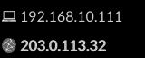
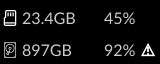
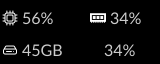
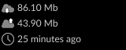

# cloudkey

**cloudkey** is a replacement for `/usr/bin/ck-ui` on your Ubiquiti Cloud Key
Generation 2 device: a small Go daemon that drives the front-panel OLED
display and status LEDs directly, without the stock UI.

## Screens

The display cycles through these screens, fading in and holding each one lit
before fading to a genuinely black, held-blank state (real rest time for the
OLED panel) between screens.

| Screen | Shows |
| --- | --- |
|  | Hostname and current date/time |
|  | LAN and WAN IP addresses |
|  | Used space and percent-used for the SD card (`/sdcard`) and the internal volume (`/volume`), with a warning icon past 90% used |
|  | CPU and memory utilization, plus used space and percent-used for the root filesystem |
|  | Hourly download/upload speed test results (opt-in, see `-speedtest` below) |

After boot, the status LED is blue while the daemon is idle. With `-speedtest`
enabled, it blinks blue while a speed test is running. When
`-reset-button-cmd` is configured, a physical reset-button press blinks it
white (a 300ms fade up, 300ms fade down) as acknowledgment, then returns to
blue.

## Installation

### Quick Start

1. Turn on SSH from the Unifi Console
2. `ssh root@UniFi-CloudKeyG2`
3. Download the latest `cloudkey` binary from the
   [Releases page](https://github.com/jnovack/cloudkey/releases) and copy it
   to `/usr/local/bin/cloudkey`.
4. Continue with [Using the `systemd` Service](#using-the-systemd-service)
   below. It disables the stock service without removing its binary, so you
   can restore it if needed.

#### Using the `systemd` Service

Disable the old service first.

1. `systemctl disable ck-ui`
2. `systemctl stop ck-ui`

Install this one.

1. Copy `cloudkey.service` to `/lib/systemd/system/` and ensure the
   downloaded or built binary is at `/usr/local/bin/cloudkey`.
2. `touch /etc/cloudkey.env` and set any flags you need as environment
   variables (see Configuration below).
3. `systemctl daemon-reload`
4. `systemctl enable cloudkey`
5. `systemctl start cloudkey`

### Developers

1. Have a working Go environment (see `go.mod` for the minimum version).
2. `make build` — cross-compiles for the Cloud Key's `linux/arm` target and
   writes the binary to `.local/bin/cloudkey`.
3. SCP the file over to your Cloud Key, or use `make deploy` if you've set
   `DEPLOY_HOST`/`DEPLOY_KEY` in the `Makefile` for your device.

At this point, you can choose to back up and overwrite the `/usr/bin/ck-ui`
file or install the systemd service above, depending on your Linux
experience.

## Configuration

Every flag can also be set via an environment variable — useful for
`/etc/cloudkey.env` under systemd. Env vars are the flag name uppercased,
with dashes replaced by underscores, prefixed with `CLOUDKEY_`.

| Flag | Env var | Default | Description |
| --- | --- | --- | --- |
| `-delay` | `CLOUDKEY_DELAY` | `5000` | Milliseconds each screen stays lit |
| `-blank-delay` | `CLOUDKEY_BLANK_DELAY` | `3000` | Milliseconds screens stay blanked between screens |
| `-demo` | `CLOUDKEY_DEMO` | `false` | Use fake screen data instead of network, storage, CPU/memory, and speed-test collection; the framebuffer and LEDs still require target hardware |
| `-speedtest` | `CLOUDKEY_SPEEDTEST` | `false` | Enable and display the speedtest screen |
| `-reset-button-cmd` | `CLOUDKEY_RESET_BUTTON_CMD` | `""` | Shell command to run on a single physical reset-button press (empty disables the watcher) |
| `-pidfile` | `CLOUDKEY_PIDFILE` | `/var/run/cloudkey.pid` | Pidfile path |
| `-reset` | `CLOUDKEY_RESET` | `false` | Clear the screen and exit, instead of running normally |
| `-version` | `CLOUDKEY_VERSION` | `false` | Print version and exit |

Example `/etc/cloudkey.env`:

```text
CLOUDKEY_SPEEDTEST=true
CLOUDKEY_RESET_BUTTON_CMD=systemctl restart unifi
```

## Why?

I am an edge case.  I do not use my Cloud Key device for Unifi.  I think it is
a great sexy little hardware device, but to manage a network off of what is
essentially a POE SDCard, you are insane.

Issues with stability are [very well documented](https://help.ubnt.com/hc/en-us/articles/360000128688-UniFi-Troubleshooting-Offline-Cloud-Key-and-Other-Stability-Issues#4).
Using mongodb on an sdcard (limited write cycles) without *automatically*
reparing has lead me to have to recover 4 times in 2 years even with the
secondary USB power from the UPS. That is NOT remotely production stable.
Run Unifi on a server, not a "raspberry pi".

With that said, I am sure you are asking yourself *"Why do you have it all?"*
The Ubiquity Cloud Key Gen2 is a POE, ARMv7, Single-Board-Computer with
on-board battery backup and a 160x64 framebuffer display built-in.  It is
sexy, for under $200. It looks like an iDevice.

Sure, you can buy a $35 Raspberry Pi, add a case, with a touchscreen, with
a power-supply, and blah blah, but I'll pay for quality and craftmanship so
it does not look like another Frankenstein project around my house.

I can ship it to my parents, tell them to plug one cable into the new-fangled
doo-hickey and tell them to call their ISP when it has a sad face on it
(feature not developed yet).
