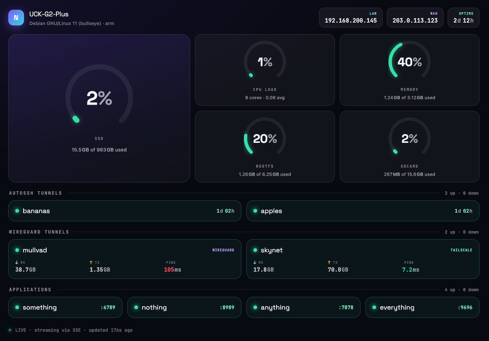

# cloudkey

**cloudkey** is a replacement for `/usr/bin/ck-ui` on your Ubiquiti Cloud Key
Generation 2 device: a small Go daemon that drives the front-panel OLED
display and status LEDs directly, without the stock UI, with an optional web
dashboard. Works on UCK-G2 and UCK-G2-PLUS models.

## What's It Do?

The display cycles through these screens, fading in and holding each one lit
before fading to a genuinely black, held-blank state (real rest time for the
OLED panel) between screens.

| Screen | Shows |
| --- | --- |
|  | Hostname and current date/time |
|  | LAN and WAN IP addresses |
|  | Used space and percent-used for the SD card (`/sdcard`) and the internal volume (UCK-G2-PLUS only) (`/volume`), with a warning icon past 90% used |
|  | CPU and memory utilization, plus used space and percent-used for the root filesystem |
|  | Up/down status for one or two autossh tunnels (opt-in, see `-autossh-tunnel1-name` below) |
|  | WireGuard tunnel connection status (opt-in, see `-wireguard-iface` below) |
|  | Tailscale connection status (opt-in, see `-tailscale` below) |

Web Dashboard (opt-in, see -http-port below)



## The Cloud Key Runbook

cloudkey replaces the front panel. The
**[wiki](https://github.com/jnovack/cloudkey/wiki)** covers everything else —
a phase-by-phase runbook for turning a Cloud Key Gen2 / Gen2 Plus into a
plain Debian server and building on it. Verified on real hardware, written
so a stranger can follow along, and paired with ready-to-run scripts in
[`scripts/runbook/`](scripts/runbook/).

| Phase | What it gets you |
| --- | --- |
| [1 — De-Ubiquitizing](https://github.com/jnovack/cloudkey/wiki/Phase-1-De-Ubiquitizing) | Strip the UniFi stack (keeping the packages that must stay), install cloudkey in place of `ck-ui`, format and mount the internal drive, harden to an admin user with key-only SSH |
| [2 — Apps](https://github.com/jnovack/cloudkey/wiki/Phase-2-Apps) | NZBGet, Sonarr, Radarr, Prowlarr on ARM, plus [hardening](https://github.com/jnovack/cloudkey/wiki/Phase-2-Hardening) — SQLite healing, liveness probes, surviving upgrades |
| [3 — AutoSSH](https://github.com/jnovack/cloudkey/wiki/Phase-3-AutoSSH) | A reverse-SSH rescue tunnel through a relay, so you can still reach the box when the network moves out from under it (feeds the autossh screen above); [macOS variant](https://github.com/jnovack/cloudkey/wiki/macOS-AutoSSH) included |
| [4 — WireGuard](https://github.com/jnovack/cloudkey/wiki/Phase-4-WireGuard) | Fail-closed VPN egress using a network namespace — apps get no route at all if the tunnel drops, plus health checks and self-healing (feeds the wireguard screen) |
| [5 — Headscale](https://github.com/jnovack/cloudkey/wiki/Phase-5-Headscale) | A self-hosted Headscale + headplane control server and client enrolment, including a [Synology NAS](https://github.com/jnovack/cloudkey/wiki/Tailscale-for-Synology) (feeds the tailscale screen) |
| [9 — Backup & Restore](https://github.com/jnovack/cloudkey/wiki/Phase-9-Backup-Restore) | Back every custom file up to the SD card and put it back on a rebuilt box |

Also there: [CloudKey Admin Tools](https://github.com/jnovack/cloudkey/wiki/CloudKey-Admin-Tools),
an on-box status dashboard and diagnostic runbook that works across every phase.

Wiki pages are edited in [`wiki/`](wiki/) in this repo and published by CI —
so send wiki fixes as a pull request, not through the wiki's web editor
(those edits get overwritten).

## Installation

### Quick Start

1. Turn on SSH from the Unifi Console
2. `ssh root@UniFi-CloudKeyG2`
3. Download the latest `cloudkey` binary from the
   [Releases page](https://github.com/jnovack/cloudkey/releases) and copy it
   to `/usr/local/bin/cloudkey`.
4. Continue with [Using the `systemd` Service](#using-the-systemd-service)
   below. It disables the stock service without removing its binary, so you
   can restore it if needed.

#### Using the `systemd` Service

Disable the old service first.

1. `systemctl disable ck-ui`
2. `systemctl stop ck-ui`

> **Do not skip this.** `ck-ui` and `cloudkey` both drive the OLED panel, and
> both want the front-panel reset button — but the button's event device
> (`/dev/input/event1`) can only be read usefully by one process. Leaving
> `ck-ui` running means the two fight over the panel, and the stock daemon's
> timed button behaviour (a documented factory reset on a long hold) stays
> live alongside cloudkey's own. Verify with `fuser -v /dev/input/event1` —
> `cloudkey` should be the only listed consumer.

Install this one.

1. Copy `cloudkey.service` to `/lib/systemd/system/` and ensure the
   downloaded or built binary is at `/usr/local/bin/cloudkey`.
2. `touch /etc/cloudkey.env` and set any flags you need as environment
   variables (see Configuration below).
3. `systemctl daemon-reload`
4. `systemctl enable cloudkey`
5. `systemctl start cloudkey`

### Developers

1. Have a working Go environment (see `go.mod` for the minimum version).
2. `make build` — cross-compiles for the Cloud Key's `linux/arm` target and
   writes the binary to `.local/bin/cloudkey`.
3. Set `DEPLOY_HOST`/`DEPLOY_KEY` in the `Makefile` (or pass them on the
   command line) for your device, then:
   - `make install` — first-time setup: installs the systemd unit, creates
     `/etc/cloudkey.env` and the web root, enables the service, and deploys.
   - `make deploy` — every time after: pushes a new binary and dashboard and
     restarts the service. It expects the unit to already exist, so run
     `make install` once first.

Both targets act on the remote device over SSH. `make install` is idempotent,
so re-run it after changing `cloudkey.service`.

At this point, you can choose to back up and overwrite the `/usr/bin/ck-ui`
file or install the systemd service above, depending on your Linux
experience.

## Configuration

Every flag can also be set via an environment variable — useful for
`/etc/cloudkey.env` under systemd. Env vars are the flag name uppercased,
with dashes replaced by underscores, prefixed with `CLOUDKEY_`.

| Flag | Env var | Default | Description |
| --- | --- | --- | --- |
| `-delay` | `CLOUDKEY_DELAY` | `5000` | Milliseconds each screen stays lit |
| `-blank-delay` | `CLOUDKEY_BLANK_DELAY` | `3000` | Milliseconds screens stay blanked between screens |
| `-demo` | `CLOUDKEY_DEMO` | `false` | Use fake screen data instead of network, storage, and CPU/memory collection; the framebuffer and LEDs still require target hardware |
| `-stealth-mode` | `CLOUDKEY_STEALTH_MODE` | `false` | Start with the front panel dark — no LEDs, no screens. A brief reset-button tap toggles it at runtime; see [Stealth mode](#stealth-mode) |
| `-pidfile` | `CLOUDKEY_PIDFILE` | `/var/run/cloudkey.pid` | Pidfile path |
| `-reset` | `CLOUDKEY_RESET` | `false` | Clear the screen and exit, instead of running normally |
| `-version` | `CLOUDKEY_VERSION` | `false` | Print version and exit |
| `-autossh-tunnel1-name` | `CLOUDKEY_AUTOSSH_TUNNEL1_NAME` | `""` | Label for the first autossh tunnel; empty disables the autossh screen entirely |
| `-autossh-tunnel1-service` | `CLOUDKEY_AUTOSSH_TUNNEL1_SERVICE` | `""` | systemd unit name to check for the first tunnel's liveness (e.g. `autossh-tunnel1`); empty always shows down |
| `-autossh-tunnel2-name` | `CLOUDKEY_AUTOSSH_TUNNEL2_NAME` | `""` | Label for the second autossh tunnel; empty hides the second row |
| `-autossh-tunnel2-service` | `CLOUDKEY_AUTOSSH_TUNNEL2_SERVICE` | `""` | systemd unit name to check for the second tunnel's liveness |
| `-wireguard-name` | `CLOUDKEY_WIREGUARD_NAME` | `WireGuard` | Display name for the WireGuard screen |
| `-wireguard-iface` | `CLOUDKEY_WIREGUARD_IFACE` | `""` | WireGuard interface to check, e.g. `wg0`; empty disables the wireguard screen |
| `-wg-cmd` | `CLOUDKEY_WG_CMD` | `wg` | `wg` binary to run for WireGuard status checks; override if it's not on `PATH` |
| `-tailscale` | `CLOUDKEY_TAILSCALE` | `false` | Enable and display the Tailscale screen |
| `-tailscale-name` | `CLOUDKEY_TAILSCALE_NAME` | `TailScale` | Display name for the Tailscale screen |
| `-tailscale-cmd` | `CLOUDKEY_TAILSCALE_CMD` | `tailscale` | `tailscale` binary to run for Tailscale status checks; override if it's not on `PATH` |
| `-http-port` | `CLOUDKEY_HTTP_PORT` | `0` | TCP port for the web dashboard + `/events` SSE stream; `0` disables it. Port 80 needs root or `cap_net_bind_service` |
| `-web-root` | `CLOUDKEY_WEB_ROOT` | `/usr/share/cloudkey/website` | Directory of dashboard static files served at `/` |
| `-apps` | `CLOUDKEY_APPS` | `""` | Comma-separated local apps to show on the dashboard, each `name:port` (e.g. `Grafana:3000,Sonarr:8989`); an app is up when its port is LISTENing in any network namespace on this box |

If the wireguard or tailscale screen is enabled but its binary can't be
found, cloudkey exits at startup with an error rather than silently showing
"disconnected" forever — a missing dependency is a configuration error to
fix, not a display state.

### Web dashboard

Setting `CLOUDKEY_HTTP_PORT` starts an HTTP server that serves the responsive
web dashboard (the files under `website/`) and a live [Server-Sent Events][sse]
stream at `/events`. The same collector timers that drive the OLED carousel also
push their readings to the browser, so the dashboard updates without polling.

The stream is incremental: a browser gets one full snapshot on connect, then
each timer pushes only its own slice (a WireGuard tick sends just that tunnel, a
CPU tick just CPU). Tunnels carry live transfer counters and latency where the
source exposes them — WireGuard rx/tx and handshake age from `wg show <iface>`,
Tailscale rx/tx from `tailscale status --json`, plus an ICMP ping to the peer.
The dashboard tunnel cards show RX, TX, and either Ping when connected or Last
Seen when disconnected.

The `-apps` list adds simple tiles below the tunnels. Each entry is `name:port`
for an app on the Cloud Key itself. On Linux, cloudkey reads this box's TCP
LISTEN tables across every network namespace and marks an app up when that port
is listening; where those tables are unavailable, it falls back to a loopback
TCP dial. Dashboard links use the same scheme and hostname currently showing
the dashboard, with only the port changed. Provide as many as you like; names
may not contain `:` or `,`.

Binding port 80 requires privilege — run as root (the service already does) or
grant the binary the capability once:

```bash
sudo setcap cap_net_bind_service=+ep /usr/local/bin/cloudkey
```

[sse]: https://developer.mozilla.org/en-US/docs/Web/API/Server-sent_events

### Stealth mode

The cloudkey daemon always drives the front panel: boot logo, loader animation,
a steady blue "running" LED, and the OLED carousel rotating forever. There is no
way to make the device go dark — useful when the box sits in a bedroom or any
shared space where a glowing panel is unwanted.

`CLOUDKEY_STEALTH_MODE` (default `false`) suppresses **all** front-panel
output — LEDs and OLED both — toggled at runtime by a physical reset-button
tap. Engaging shows a `Stealth Mode / ENGAGED` banner for 5 seconds so you know
the press registered, then the panel goes fully dark. Disengaging is a silent
resume: LEDs return and the carousel restarts mid-rotation, no banner.

Stealth is display-only. The collector timers and the web dashboard / SSE stream
keep running untouched — a dark panel must not mean a dead device.

Two things worth knowing before you go looking for a bug:

- **The tap has to be brief** — roughly a tenth to half a second. A longer hold
  lands in a different press band and does nothing at all, which is easy to
  mistake for a broken button. The band cloudkey classified each press into is
  logged, so check the journal if a press seems ignored.
- **The flip is not persisted.** Restarting the service returns to whatever
  `CLOUDKEY_STEALTH_MODE` says, so set it there if you want dark to be the
  default.

## Boring Details

WireGuard and Tailscale check actual tunnel liveness rather than the
systemd unit state of the underlying service: `wg-quick@<iface>` is
typically a one-shot unit that stays "active" forever once `wg-quick up`
succeeds, and `tailscaled`'s unit reports "active" whenever the daemon
process is running, neither of which reflects the peer/tailnet actually
being reachable. So WireGuard status comes from the human-readable
`wg show <iface>` output (recent handshake age plus transfer counters), and
Tailscale status comes from `tailscale status --json`'s `BackendState`.

autossh is the exception: `-R` (remote) forwards bind no local port to
probe, so without a `-M` monitor port there's no local traffic signal to
check at all. autossh status therefore falls back to `systemctl is-active
<unit>` — which only proves the autossh/ssh process is still running, not
that the tunnel is passing traffic. Pair each tunnel's ssh config with
`ServerAliveInterval`/`ServerAliveCountMax` so a genuinely dead connection
makes the process exit (and the unit go inactive) instead of hanging open
indefinitely; without that, a stale tunnel can still show as "up".

The blue and white LEDs are one status indicator, not two: white alone means
powered but not running (during boot, and after the service stops), blue alone
means running. After boot the status LED is therefore blue while the daemon is
idle. In stealth mode both are dark, including on shutdown — see
[Stealth mode](#stealth-mode).

The reset button is read as a plain evdev key and classified by how long it was
held, measured key-down to key-up. Only a brief tap does anything today; the
longer bands are reserved and deliberately separated by dead zones, so releasing
between bands is always a safe no-op. Nothing fires past six seconds.

`CLOUDKEY_WIREGUARD_NAME` is just the label shown as the screen's title —
pick anything (it defaults to `WireGuard`). `CLOUDKEY_WIREGUARD_IFACE`
is not free text: it has to match the real interface name on the device
running cloudkey. To find it, run one of these on that device:

```bash
wg show interfaces        # lists every active WireGuard interface
ip link show type wireguard
```

If the tunnel is managed by `wg-quick` (as `wg-quick@<iface>` under
systemd), the interface name is also the config file's name minus
`.conf` — `/etc/wireguard/wg0.conf` means `wg0` — or you can read it
straight off the unit:

```bash
systemctl list-units 'wg-quick@*'
```

See [`cloudkey.env.example`](cloudkey.env.example) for a starter `/etc/cloudkey.env`. Example:

```text
CLOUDKEY_STEALTH_MODE=true
```

## Why?

I am an edge case.  I do not use my Cloud Key device for Unifi.  I think it is
a great sexy little hardware device, but to manage a network off of what is
essentially a POE SDCard, you are insane.

Issues with stability are [very well documented](https://help.ubnt.com/hc/en-us/articles/360000128688-UniFi-Troubleshooting-Offline-Cloud-Key-and-Other-Stability-Issues#4).
Using mongodb on an sdcard (limited write cycles) without *automatically*
reparing has lead me to have to recover 4 times in 2 years even with the
secondary USB power from the UPS. That is NOT remotely production stable.
Run Unifi on a server, not a "raspberry pi".

With that said, I am sure you are asking yourself *"Why do you have it all?"*
The Ubiquity Cloud Key Gen2 is a POE, ARMv7, Single-Board-Computer with
on-board battery backup and a 160x64 framebuffer display built-in.  It is
sexy, for under $150. It looks like an iDevice.

Sure, you can buy a $35 Raspberry Pi, add a case, with a touchscreen, with
a power-supply, and blah blah, but I'll pay for quality and craftmanship so
it does not look like another Frankenstein project around my house.

I can ship it to my parents, tell them to plug one cable into the new-fangled
doo-hickey and tell them to call their ISP when it has a sad face on it
(feature not developed yet).
