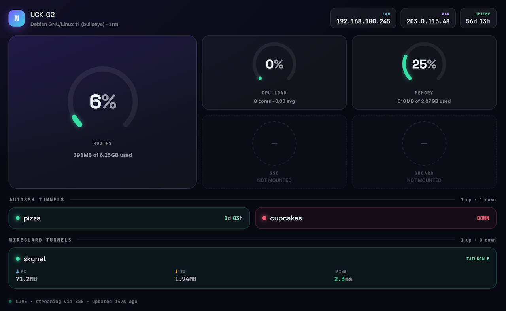
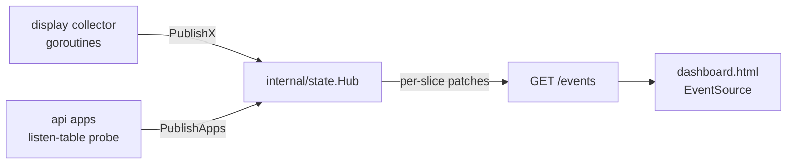

# Web dashboard architecture

The dashboard is optional and off by default. It turns on when
`CLOUDKEY_HTTP_PORT` is set (see the [Configuration](../README.md#configuration)
table). This note documents the wire format and the moving parts, for anyone
editing either side.

## Pieces

- `internal/state` — the shared hub. Holds the authoritative merged snapshot
  and fans per-slice patches out to subscribers. It is the contract package;
  its `Snapshot` JSON tags **are** the protocol.
- `internal/api` — serves the static `website/` files and the `/events` SSE
  stream, and runs the app-liveness collector. Liveness is read from the host
  kernel's TCP listen tables (`/proc/net/tcp{,6}`, read once per network
  namespace) — each tick marks an app `up` if its port is listening, covering
  every local bind with no connect handshake. Scanning every namespace, not just
  the root one, is what lets apps confined to a VPN split-tunnel netns or a
  container be seen; it falls back to a loopback TCP dial where `/proc` is
  unreadable.
- `internal/display` — the existing OLED screen goroutines. Each one, on the
  same timer that redraws its screen, also calls a `publishX` helper so the
  browser and the panel share one set of timers.

## Message format

One JSON object per SSE `data:` line. There are two shapes, handled by the same
browser merge:

- **Initial frame** (on connect): the full object, every top-level key.
- **Update frame** (per timer tick): only the changed key(s).

Top-level keys and their types (bytes are raw integers; the front-end formats
them):

| Key | Shape | Source timer |
| --- | --- | --- |
| `host` | `{name, os, arch, uptimeSec}` | host screen |
| `net` | `{lan, wan}` | network screen |
| `cpu` | `{pct, cores, loadAvg}` | system screen |
| `mem` | `{used, total}` | system screen |
| `ssd` / `rootfs` / `sdcard` | `{mounted, used, total}` | storage / system screens |
| `apps` | `[{name, port, up}]` | api apps collector |
| `tunnels` | `[{name, type, up, rx, tx, conn, ping, lastSeen}]` | autossh / wireguard / tailscale screens |

`tunnels[].type` is one of `AUTOSSH`, `WIREGUARD`, `TAILSCALE`. Fields a source
cannot supply are left zero and render as `—`. The disk keys map to the mounts
`rootfs`=`/`, `sdcard`=`/sdcard`, `ssd`=`/volume`.

`apps[]` carries no probe address on purpose: liveness is decided server-side,
and the browser builds each tile's link from the page's own scheme and hostname
with only the port swapped. A card can therefore read `up` while its link does
not resolve — the port is listening in some namespace on the box, but is not
exposed to the LAN at the dashboard's host.

## Merge rules (browser)

`dashboard.html`'s `mergePatch` applies each frame onto local state:

- `tunnels` is upserted **by type and name** — each tunnel timer publishes only
  its own tunnel, so the browser keeps the others, and Type stays in the key
  because display names are configurable across sources.
- every other key replaces its slot wholesale.

The initial frame does **not** go through `mergePatch` — a full snapshot
replaces local state outright. That is deliberate: merging would upsert
`tunnels` by type and name and so preserve any seeded tunnel the server did not
send, which is exactly the stale row a fresh connection must clear.

## Adding a new slice

1. Add the field (with its JSON tag) to `state.Snapshot` and a typed
   `PublishX` method that updates that field and broadcasts just its slice.
2. Publish from the owning collector — a display screen goroutine (via a
   `publishX` helper in `internal/display`, kept nil-safe so display-only runs
   and unit tests work) or a new api collector.
3. Teach `mergePatch` in `dashboard.html` if the slice needs anything other than
   wholesale key replacement (arrays keyed by identity, like `tunnels`, do).
