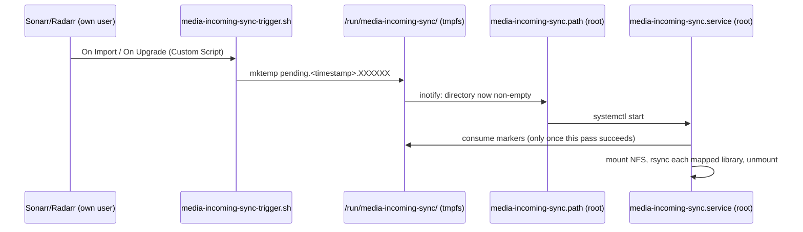

# Keeping the media stack running: upgrades, hangs, bad downloads

This is for anyone who's already worked through [Phase 2](Phase-2-Apps) and
wants NZBGet, Sonarr, Radarr, and Prowlarr to keep running reliably —
surviving their own upgrades, catching silent hangs, and handling
downloads that would otherwise sit stuck. Each part below stands on
its own and fixes one real failure mode found running the stack, so
treat this as a reference to dip into rather than a script to run top
to bottom — see [Phase 2 Overview](Phase-2-Overview) for the fuller story behind each
one.

Part numbering continues from [Phase 2](Phase-2-Apps) rather than restarting
at 1, since several of these parts reference each other and Parts 4
and 5 by number.

## Index

- [Part 8: Surviving in-app upgrades](#part-8-surviving-in-app-upgrades)
- [Part 9: A liveness probe for all four apps](#part-9-a-liveness-probe-for-all-four-apps)
- [Part 10: Auto-fixing obfuscated no-extension downloads](#part-10-auto-fixing-obfuscated-no-extension-downloads)
- [Part 11: Getting organized media to whatever plays it](#part-11-getting-organized-media-to-whatever-plays-it)

## Part 8: Surviving in-app upgrades

Sonarr, Radarr, and Prowlarr can update themselves from their own web
UI, and that works here — the download and install succeed. What doesn't
survive is the SQLite symlink from Parts 4 and 5: an upgrade replaces
`/opt/<App>` wholesale, restoring the bundled library that can't load on
this OS. The app then crashes on its database layer the moment it
restarts.

That crash is worth understanding, because it doesn't look like one.
On a startup failure these apps print `Press enter to exit...` and block
on standard input forever instead of quitting. The process stays alive,
so `systemctl status` reports `active (running)` and `Restart=on-failure`
never triggers — there's no non-zero exit for systemd to react to. You
get a service that claims to be healthy, holds a few hundred MB of
memory, and answers nothing.

> [!IMPORTANT]
> `systemctl status` alone can't tell you an upgrade actually worked —
> a hung app still reports `active (running)`. Confirm with the app's
> own API or its log instead.

Rather than remembering a manual repair after every upgrade, run it
before every start. This script re-points the symlink only when the
bundled library genuinely can't load:

```bash
install -m 755 scripts/runbook/phase2-05-servarr-sqlite-heal.sh \
  /usr/local/sbin/servarr-sqlite-heal.sh
```

Wire it in for both affected apps (Sonarr doesn't ship this library, so
it needs nothing):

```bash
for a in radarr prowlarr; do
  A=$(echo ${a^})
  mkdir -p /etc/systemd/system/$a.service.d
  cat > /etc/systemd/system/$a.service.d/sqlite-glibc.conf <<EOF
[Service]
ExecStartPre=/usr/local/sbin/servarr-sqlite-heal.sh $A
EOF
done
systemctl daemon-reload
```

The script is deliberately advisory: if it can't make the repair it
still exits 0 and lets the app start, so it can never be the reason a
service fails to come up. It also tests the bundled library with `ldd`
rather than assuming it's broken, so a future upstream build that
*is* compatible won't be needlessly replaced.

To verify it works, break it on purpose and watch it heal:

```bash
cd /opt/Radarr
cp libe_sqlite3.so.backup libe_sqlite3.so   # simulate a fresh upgrade
systemctl restart radarr
journalctl -u radarr -n 30 | grep servarr-sqlite-heal
```

You should see it report the repair, and `/opt/Radarr/libe_sqlite3.so`
should be a symlink again.

## Part 9: A liveness probe for all four apps

Part 8 prevents the one hang we know how to trigger. This catches the
general case: any app that's running but not actually serving. Works
the same either way whether or not you built Phase 4 (the VPN
killswitch, optional) — see the note on `NETNS` below.

It's worth understanding why systemd can't do this itself. Its idea of
"running" is "the main process hasn't exited." When one of these apps
dies during startup but its process lingers, that test passes and
everything downstream of it — `Restart=on-failure`, `systemctl status`,
`is-active` — reports health. Confirmed by testing: in that state
`systemctl is-active radarr` says `active` while **nothing at all is
listening on port 7878**. The only way to tell the two apart is to ask
the app a question over the network.

All four expose an endpoint that needs no credentials, which matters —
a probe holding API keys would break silently whenever a key is
rotated:

| App | Port | Endpoint |
| --- | --- | --- |
| NZBGet | 6789 | `/jsonrpc/version` |
| Sonarr | 8989 | `/ping` |
| Radarr | 7878 | `/ping` |
| Prowlarr | 9696 | `/ping` |

Install the probe and its timer:

```bash
install -m 755 scripts/runbook/phase2-06-servarr-liveness-probe.sh \
  /usr/local/sbin/servarr-liveness-probe.sh

cat > /etc/systemd/system/servarr-liveness-probe.service <<'EOF'
[Unit]
Description=Probe media apps for the alive-but-not-serving failure mode
After=network.target

[Service]
Type=oneshot
ExecStart=/usr/local/sbin/servarr-liveness-probe.sh
EOF

cat > /etc/systemd/system/servarr-liveness-probe.timer <<'EOF'
[Unit]
Description=Run the media-app liveness probe every minute

[Timer]
OnBootSec=3min
OnUnitActiveSec=60s
AccuracySec=10s

[Install]
WantedBy=timers.target
EOF

systemctl daemon-reload
systemctl enable --now servarr-liveness-probe.timer
```

The probe is deliberately reluctant to act, because one that restarts
things incorrectly is worse than none at all. It only considers units
that are already `active` (a service you stopped stays stopped), ignores
an app for 90 seconds after it starts so normal startup never reads as
a hang, needs three consecutive failures before restarting, and caps
restarts at three per app per hour — past that it logs loudly and stops,
on the grounds that if restarting hasn't helped by then, the problem
isn't one a restart fixes.

**If you built Phase 4** (the VPN killswitch — entirely optional, skip
this note if you didn't), the four apps listen on loopback *inside*
that namespace, not the host's. Set `NETNS="<vpn>"` near the top of the
script (same value substituted for `<vpn>` throughout
[Phase 4](Phase-4-WireGuard)) so probes reach them; left empty (the default),
the script probes the host's own loopback directly, which is correct
for a setup without Phase 4. Either way this stays decoupled from VPN
health: the apps bind loopback *inside* the namespace when pinned there,
which keeps working whether or not the tunnel itself is up, so a VPN
outage can't trigger a spurious restart here. Tunnel health is
`vpn-heal.sh`'s job (Phase 4 Part 6), not this script's. An earlier
version of this script hardcoded the namespace name and skipped probing
entirely if it was missing — meaning on any setup that skipped Phase 4,
this probe silently never did anything, ever; worth knowing if you're
comparing against an older deployment.

Logging is transition-only — it reports failures, restarts, and
recoveries, but stays silent while things are healthy. At a 60-second
interval, logging every successful pass would bury real events and eat
into this box's 500MB persistent journal budget (set in
[Phase 1](Phase-1-De-Ubiquitizing), "Before you start" item 5) for nothing.

To verify it end to end, break Radarr on purpose with Part 8's repair
temporarily disabled:

```bash
mv /etc/systemd/system/radarr.service.d/sqlite-glibc.conf /root/
systemctl daemon-reload
cp /opt/Radarr/libe_sqlite3.so.backup /opt/Radarr/libe_sqlite3.so
systemctl restart radarr           # now hung: "active" but not serving

sleep 95                           # wait out the startup grace period
/usr/local/sbin/servarr-liveness-probe.sh   # 1/3
/usr/local/sbin/servarr-liveness-probe.sh   # 2/3

mv /root/sqlite-glibc.conf /etc/systemd/system/radarr.service.d/
systemctl daemon-reload
/usr/local/sbin/servarr-liveness-probe.sh   # restarts; Part 8 repairs it
```

The third run should report the restart, and Radarr should answer
`/ping` again within about 15 seconds.

## Part 10: Auto-fixing obfuscated no-extension downloads

Some Usenet reposts — "-xpost" groups especially — ship every file in
the release deliberately renamed to garbage
(`[PRiVATE]_xxx...yEnc  1547065448 (1_2159)`) and include no par2
recovery files at all (the checksum files NZBGet normally uses to
verify a download and recover its real name). NZBGet's own de-obfuscation
(`ParRename`/`DirectRename`) can only recover a real filename by
reading it back out of a matching par2 file — with none present, it has
nothing to check against, and moves the file through to `completed/`
exactly as obfuscated as it arrived. Sonarr and Radarr only recognize
video files by extension, so a download like this silently never gets
imported — even though the video content inside is often perfectly
fine. See [Phase 2 Overview](Phase-2-Overview) for the real case (a movie) that
surfaced this.

This script runs as an NZBGet post-processing extension after every
download. If NZBGet didn't already produce a file with a recognized
video extension, it sniffs the first bytes of each sufficiently large
file for a known container signature (MP4/MOV, Matroska/WebM, AVI,
ASF/WMV, raw MPEG-TS) and renames it accordingly — the same fix as
doing it by hand, just automatic. It's deliberately narrow: it never
touches a download that already contains a recognized video file, and
it renames rather than deletes, so a same-obfuscated-looking file it
doesn't recognize (a subtitle, say) is left alone rather than guessed
at. Only when *nothing* in the folder can be identified as video —
a genuinely junk/fake release — does it mark the download failed
(`[NZB] MARK=BAD`), so Sonarr/Radarr's own failed-download handling can
blocklist it and search again instead of leaving a dead, unimportable
folder behind. That auto-blocklist-and-retry needs "Failed Download
Handling" enabled in Sonarr/Radarr (the default) — without it, the
download just sits marked `FAILURE` in NZBGet's history for you to
handle by hand. This is the only path that can trigger a re-download,
and it only fires when the content was never recoverable in the first
place.

Install it:

```bash
install -m 0755 -o nzbget -g nzbget \
  scripts/runbook/phase2-07-nzbget-fix-obfuscated.sh \
  /var/lib/nzbget/scripts/fix-obfuscated.sh

sed -i 's|^Extensions=.*|Extensions=fix-obfuscated.sh|' \
  /var/lib/nzbget/nzbget.conf
systemctl restart nzbget
```

NZBGet only registers a file in `ScriptDir` as a post-processing script
if it finds the exact banner/OPTIONS-section structure documented at
the top of the script file — a plain comment, or the wrong shape, is
silently ignored (logged as `'name' doesn't exist`, easy to miss).
Confirm it loaded cleanly with no such warning:

```bash
journalctl -u nzbget --no-pager -n 30 | grep -i extension
```

Silence here means the banner was found, but it's not the whole story:
the OPTIONS section below the banner needs its own closing
`### NZBGET ... SCRIPT ###` line too, or NZBGet keeps reading past it
and parses the script's own code as bogus config options — silently,
with no journal warning at all (confirmed live 2026-09-16: nzbget's
`loadextensions` API showed garbage option names like
`OSTPROCESS_SUCCESS` where `POSTPROCESS_SUCCESS=93` should have been
inert). The script still runs in that state, so functionally you may
not notice — but it's worth a positive check after touching this file:

```bash
curl -s "http://nzbget:<ControlPassword>@127.0.0.1:6789/jsonrpc" \
  -d '{"method":"loadextensions","params":[true]}' | python3 -m json.tool
```

Look for `"PostScript": true` and an empty (or intentional-only)
`"Options"` list for `fix-obfuscated`. Run this inside the `mullvad`
netns if Phase 4 pins NZBGet into it (see Part 11).

To verify the actual rename/fail logic works, run it directly against
synthetic test folders rather than waiting for a real obfuscated
release:

```bash
# A large file with an MP4 signature but no extension -- should rename
# and exit 93 (POSTPROCESS_SUCCESS).
T=/tmp/pptest-video && mkdir -p "$T"
head -c 25000000 /dev/zero > "$T/garbage_name"
printf '\x00\x00\x00\x18ftyp' | dd of="$T/garbage_name" bs=1 conv=notrunc status=none
NZBPP_DIRECTORY="$T" NZBPP_NZBNAME=Test NZBPP_STATUS=SUCCESS/ALL \
  /var/lib/nzbget/scripts/fix-obfuscated.sh; echo "exit=$?"
ls "$T"                      # should show garbage_name.mp4
rm -rf "$T"

# Pure random junk -- should mark failed and exit 94 (POSTPROCESS_ERROR).
T=/tmp/pptest-junk && mkdir -p "$T"
head -c 25000000 /dev/urandom > "$T/junk"
NZBPP_DIRECTORY="$T" NZBPP_NZBNAME=Test NZBPP_STATUS=SUCCESS/ALL \
  /var/lib/nzbget/scripts/fix-obfuscated.sh; echo "exit=$?"
rm -rf "$T"
```

## Part 11: Getting organized media to whatever plays it

Sonarr and Radarr organize files on this box, but the thing that
actually *plays* them — Plex, Jellyfin, Emby, Kodi, whatever you use —
usually runs somewhere else, often a NAS with its own long-curated
library. This Part is a decision, then one fully-built way to
implement it.

### Choosing an approach

Four real shapes this can take:

1. **Mount-in.** This box mounts the media server's share directly at
   its own library path (e.g. via autofs). Importing *is* delivering —
   no separate sync step at all.
2. **Export-out.** This box exports its library over NFS; the media
   server mounts it instead.
3. **Feeder + push.** This box keeps its own local library and pushes
   new/changed files out whenever something imports — the approach
   built and hardened below.
4. **Split brain.** NZBGet stays here for downloading, but Sonarr and
   Radarr run on the media server itself, pulling completed downloads
   across the network rather than anything being pushed to them.

None of these is universally right. Pick based on what you already
have (a NAS with its own player app vs. nothing yet), how much you
trust NFS reliability on your network, and whether you're willing to
run the organizing apps somewhere other than this box. A few tradeoffs
that matter more than they look:

- **1 and 2 share the same real risk**: a `hard` NFS mount (the safe
  default against silent corruption) can leave a process stuck in
  uninterruptible sleep — not even killable by `SIGKILL` — if the far
  end vanishes mid-operation; `soft` avoids the hang at the cost of
  risking silent partial I/O instead. This is bounded and recoverable,
  not a reason to avoid NFS outright, but plan for it: a watchdog-style
  detector (same shape as Part 9's liveness probe, adapted to notice a
  wedged mount instead of a dead port, and reboot instead of restart) is
  what makes it self-healing. Nothing like that is built here — this
  device has no hardware watchdog to lean on, and it uses approach 3, so
  the risk doesn't apply to it — but build one if you go with 1 or 2.
- **2 also couples the media server's playback uptime to this box's
  uptime**, not just its import-time uptime. A routine reboot for
  updates interrupts everyone's playback, not just ingestion.
- **3 (below) fully decouples the two** except at sync moments, at the
  cost of local disk for the organized copy and needing to build the
  triggering yourself.

Only 3 is documented in full below — it's the only one actually built
and run against this device. 1, 2, and 4 are real, workable
architectures, but writing a full walkthrough for shapes never actually
exercised here would mean documenting guesses, not a runbook.

### The reference implementation: feeder + push

Every time Sonarr or Radarr imports a file, it triggers a script that
rsyncs the changed library out to your media server over NFS.

> [!IMPORTANT]
> The sync is additive only — it never deletes anything on the
> destination, even if the source file is later removed on this box.
> That's deliberate: the far end is presumed to already be a real,
> possibly hand-curated library, and this script should never be the
> reason something disappears from it.



Two things had to be ruled out to land on this shape: pointing
Sonarr/Radarr's Custom Script hook directly at the sync script doesn't
work, because that hook runs as the `sonarr`/`radarr` users, which have
no business mounting NFS as root; and triggering a fixed systemd unit
name by `sudo systemctl start` doesn't reliably work either, because
systemd merges a second `start` request into an already-active unit
rather than running it again, so a request arriving mid-sync could
never get recorded.

What actually works: Sonarr/Radarr's Custom Script points at a tiny
unprivileged wrapper that just drops a uniquely-named empty file into a
shared tmpfs directory (`mktemp`, so two imports landing in the same
second never collide). A systemd `.path` unit watches that directory
and starts the real sync as root whenever it's non-empty.

That also gives a stronger concurrency guarantee than anything hand-
rolled: a `systemd.path` unit rechecks its condition the instant the
service it triggered goes inactive, and restarts it immediately if the
directory is still non-empty — confirmed by testing, not just taken
from `man systemd.path`. So the sync script only has to empty the
directory once per pass, not loop internally; a request that arrives
mid-pass leaves the directory non-empty again at the moment the
service deactivates, and systemd starts another pass on its own,
without the unclosable race a hand-rolled lock-and-retry loop would
have between its last check and releasing the lock.

One subtlety worth getting right if you adapt this: the script claims
(captures into a list) whatever's in the trigger directory *before*
mounting, but only deletes that list at the very end, and only if the
pass fully succeeded. Deleting upfront is the natural-looking way to
write it and it's wrong — a failed mount leaves the directory empty
either way, so systemd sees "nothing pending" and never retries a
request that was never actually satisfied.

#### Install

Copy the example environment file and fill in your own values:

```bash
install -m 0755 -o root -g root scripts/runbook/phase2-08-media-incoming-sync.sh \
  /usr/local/sbin/media-incoming-sync.sh
install -m 0755 -o root -g root \
  scripts/runbook/phase2-08-media-incoming-sync-trigger.sh \
  /usr/local/sbin/media-incoming-sync-trigger.sh
install -m 0644 scripts/runbook/phase2-08-media-incoming-sync.tmpfiles.conf \
  /etc/tmpfiles.d/media-incoming-sync.conf
install -m 0644 scripts/runbook/phase2-08-media-incoming-sync.path \
  /etc/systemd/system/media-incoming-sync.path
install -m 0644 scripts/runbook/phase2-08-media-incoming-sync.service \
  /etc/systemd/system/media-incoming-sync.service

cp scripts/runbook/phase2-08-media-incoming-sync.env.example /etc/media-incoming-sync.env
chmod 0600 /etc/media-incoming-sync.env
# edit /etc/media-incoming-sync.env now -- NFS_HOST, NFS_EXPORT, SRC,
# and one MAPPING_SRC_N/MAPPING_DST_N pair per library

systemd-tmpfiles --create /etc/tmpfiles.d/media-incoming-sync.conf
systemctl daemon-reload
systemctl enable --now media-incoming-sync.path
```

The script itself never changes between setups — every device-specific
value lives in `/etc/media-incoming-sync.env`, loaded with a plain
`source` inside the script rather than systemd's own
`EnvironmentFile=`, specifically so a manual run (troubleshooting,
`--verify`) needs no systemd involvement to pick up the same config.

Then wire Sonarr and Radarr's Custom Script connections (once, not part
of a routine redeploy) — repeat for each app's own port and API key
from `/var/lib/<app>/config.xml`:

```bash
curl -s -X POST -H "Content-Type: application/json" \
  -d '{
    "onGrab": false, "onDownload": true, "onUpgrade": true,
    "name": "Media Incoming Sync",
    "fields": [
      {"name": "path", "value": "/usr/local/sbin/media-incoming-sync-trigger.sh"},
      {"name": "arguments", "value": ""}
    ],
    "implementationName": "Custom Script",
    "implementation": "CustomScript",
    "configContract": "CustomScriptSettings",
    "tags": []
  }' \
  "http://127.0.0.1:<port>/api/v3/notification?apikey=<key>"
```

If you built the optional VPN killswitch ([Phase 4](Phase-4-WireGuard)) and
Sonarr/Radarr sit inside a network namespace as a result, run that
`curl` via `ip netns exec <vpn>` instead — Custom Script hooks run
inside whatever namespace the app itself does. Skip this entirely if
you didn't build that phase; a plain `curl` is correct.

#### Verifying it

```bash
# 1. Confirm the path unit is watching.
systemctl is-active media-incoming-sync.path

# 2. Fire a trigger as the actual unprivileged user and confirm a real
#    sync runs (never as root -- that would hide a permissions
#    regression in the trigger script itself).
sudo -u radarr /usr/local/sbin/media-incoming-sync-trigger.sh
sleep 2
journalctl -u media-incoming-sync.service --no-pager -n 10

# 3. Confirm the trigger directory ends up empty again.
ls /run/media-incoming-sync
```

`--verify` (checksum-confirm only the files this pass actually
transferred) is fast and safe to use routinely. `--verify-all`
(checksum the entire mapped library, transferred or not) reads every
byte on both ends — genuinely slow on a real library, minutes rather
than seconds — so reserve it for a deliberate full-integrity check, not
routine practice:

```bash
/usr/local/sbin/media-incoming-sync.sh --verify
```

If you're touching the concurrency logic itself, don't just trust
`systemd.path`'s documented recheck-on-deactivate behavior — confirm it
against a synthetic slow test unit (a oneshot `.service` with `sleep 3`
standing in for the real work; drop one marker before starting it, a
second partway through the sleep; confirm two full start/stop cycles in
its log, the second beginning the instant the first's sleep ends)
before trusting it on the real NFS mount.

## File manifest

Everything created by this doc, for a final checklist. See
[Phase 2](Phase-2-Apps)'s own File manifest for Parts 1–7.

| Path | Purpose |
| --- | --- |
| `/usr/local/sbin/servarr-sqlite-heal.sh` | Part 8 — repairs the SQLite symlink before each start so in-app upgrades survive; source of truth [`scripts/runbook/phase2-05-servarr-sqlite-heal.sh`](https://github.com/jnovack/cloudkey/blob/main/scripts/runbook/phase2-05-servarr-sqlite-heal.sh) |
| `/etc/systemd/system/{radarr,prowlarr}.service.d/sqlite-glibc.conf` | Part 8 — runs the SQLite repair as `ExecStartPre` |
| `/usr/local/sbin/servarr-liveness-probe.sh` | Part 9 — restarts an app that's running but not serving; source of truth [`scripts/runbook/phase2-06-servarr-liveness-probe.sh`](https://github.com/jnovack/cloudkey/blob/main/scripts/runbook/phase2-06-servarr-liveness-probe.sh) |
| `/etc/systemd/system/servarr-liveness-probe.{service,timer}` | Part 9 — runs the liveness probe every 60s |
| `/var/lib/nzbget/scripts/fix-obfuscated.sh` | Part 10 — renames obfuscated no-extension video files, fails genuinely junk downloads; source of truth [`scripts/runbook/phase2-07-nzbget-fix-obfuscated.sh`](https://github.com/jnovack/cloudkey/blob/main/scripts/runbook/phase2-07-nzbget-fix-obfuscated.sh) |
| `/usr/local/sbin/media-incoming-sync.sh` | Part 11 — mounts the media server and rsyncs each mapped library; source of truth [`scripts/runbook/phase2-08-media-incoming-sync.sh`](https://github.com/jnovack/cloudkey/blob/main/scripts/runbook/phase2-08-media-incoming-sync.sh) |
| `/usr/local/sbin/media-incoming-sync-trigger.sh` | Part 11 — unprivileged wrapper Sonarr/Radarr's Custom Script calls; source of truth [`scripts/runbook/phase2-08-media-incoming-sync-trigger.sh`](https://github.com/jnovack/cloudkey/blob/main/scripts/runbook/phase2-08-media-incoming-sync-trigger.sh) |
| `/etc/tmpfiles.d/media-incoming-sync.conf` | Part 11 — recreates the tmpfs trigger dir every boot; source of truth [`scripts/runbook/phase2-08-media-incoming-sync.tmpfiles.conf`](https://github.com/jnovack/cloudkey/blob/main/scripts/runbook/phase2-08-media-incoming-sync.tmpfiles.conf) |
| `/etc/systemd/system/media-incoming-sync.path` | Part 11 — watches the trigger dir; source of truth [`scripts/runbook/phase2-08-media-incoming-sync.path`](https://github.com/jnovack/cloudkey/blob/main/scripts/runbook/phase2-08-media-incoming-sync.path) |
| `/etc/systemd/system/media-incoming-sync.service` | Part 11 — runs the sync as root, oneshot; source of truth [`scripts/runbook/phase2-08-media-incoming-sync.service`](https://github.com/jnovack/cloudkey/blob/main/scripts/runbook/phase2-08-media-incoming-sync.service) |
| `/etc/media-incoming-sync.env` | Part 11 — the only device-specific file; copy from [`scripts/runbook/phase2-08-media-incoming-sync.env.example`](https://github.com/jnovack/cloudkey/blob/main/scripts/runbook/phase2-08-media-incoming-sync.env.example) and edit, not checked in as real values anywhere |
