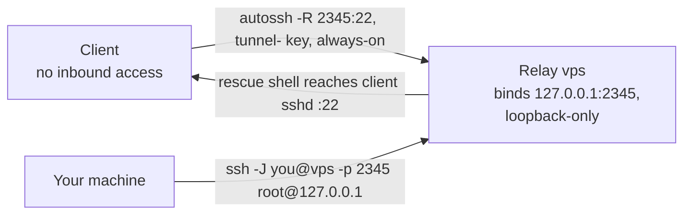
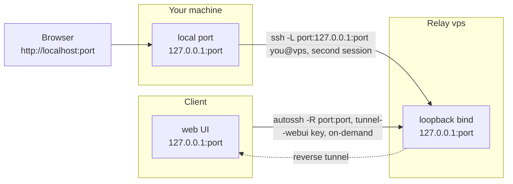

# autossh rescue tunnel: complete implementation reference

This is a complete implementation reference, not just an overview — every
config below is the **exact, currently-deployed content**, with anything
environment-specific replaced by an explicit `<placeholder>` token. A
reader or their agent should be able to implement this fully from this
document alone.

This configures reverse-SSH rescue access for a server ("the client")
that has no inbound network access of its own. The client reaches out to
an independent relay server (`<vps>`), which then exposes a
loopback-only port that, once you're logged into the relay normally,
gives you a real shell on the client.

## Placeholders

| Placeholder | Meaning | Scales to more than one? |
| --- | --- | --- |
| `<vps>` | a relay host | **Yes** — repeat every part of this guide once per relay (see note below) |
| `<port>` | one of the client's web-UI ports, Tier 2 only | **Yes** — list as many as you have |
| `<client-name>` | stable client label, `cloudkey-<last4mac>` (see below), used in relay account names and SSH public-key comments | No |

**Deriving `<client-name>`**: use `cloudkey-` plus the last four hex
digits of the client's Ethernet MAC, lowercase and without separators:

```bash
cat /sys/class/net/eth0/address     # e.g. f4:92:bf:a1:3d:07 -> cloudkey-3d07
```

The MAC is used because it is stable across reinstalls and unique per
device, which the hostname is not — several Cloud Keys ship with the same
default hostname. The label has to distinguish *devices* because one relay
commonly serves several clients, and the relay account name is the only
place that distinction is visible when auditing `authorized_keys`.

**On `<vps>` scaling**: this guide is written for one relay, but the
whole point of Tier 1 is redundancy — the deployment this was built for
uses two, so that either relay alone is enough to regain access if the
other is unreachable. To add more, repeat Parts 3 through 7 once per
`<vps>` (each relay gets its own key pair, its own dedicated accounts,
its own pair of systemd units on the client) — there's no upper limit,
two is just the number used here.

**On `<port>` scaling**: Part 6's Tier-2 unit shows the pattern with a
couple of illustrative `-R` lines and `permitlisten=` entries — add one
more of each per port you actually need forwarded, however many that is.

The tooling itself is named plainly after what it does, with the relay
accounts scoped to the specific client:
`tunnel-<client-name>`,
`tunnel-<client-name>-webui`, and
`autossh-tunnel-<vps>.service`.

This guide uses port `:2345` as the example port that autossh opens on
the `<vps>` — change it to whatever your heart desires.

One caveat if a relay serves more than one client: **each client needs
its own Tier-1 port**. The port is bound on the relay's loopback, so two
clients asking for the same one collide, and `ExitOnForwardFailure yes`
means the loser fails closed — it refuses to come up rather than quietly
sharing or stealing the port. That is the safe behaviour, but it looks
like a broken tunnel unless you know to check what else is already
listening:

```bash
ss -tln | grep 127.0.0.1:2345      # on the relay, before picking a port
```

## Architecture

- **Client**: the server being protected (in this deployment, a Cloud Key
  or Raspberry Pi-style appliance with no inbound access once relocated).
- **`<vps>`**: one or more independent, unrelated relay hosts. Each one
  is fully redundant with the others — any single relay is sufficient to
  regain access.
- **Tier 1 (always on)**: a reverse SSH tunnel forwarding only SSH access
  to the client. Supervised by `autossh` + `systemd`, restarts
  automatically if it drops.
- **Tier 2 (OPTIONAL, on demand)**: a second reverse tunnel forwarding
  the client's web UIs. Installed but disabled by default; started
  manually, from inside a Tier-1 session, only when needed.
- **Isolation**: each tier, on each relay, uses its own dedicated SSH key
  and its own dedicated, shell-less system account. A key compromise on
  one tier/relay cannot be used to reach anything else — not the other
  tier, not the relay's normal login, not a shell on the relay at all.
- **Exposure**: every forwarded port is bound to `127.0.0.1` on the relay,
  never to a public interface. Reaching the client requires first logging
  into the relay with your own normal credentials.

> [!NOTE]
> Tunnels, keys, users and other objects suffixed with `_webui` are for
> the OPTIONAL "Tier-2" and not necessary for a strictly ssh connection.
> They are provided as steps here for completeness, you may skip them.

### Tier 1 at a glance — always-on rescue tunnel



The client dials out to the relay and the connection is kept open
(`Restart=always`) — nothing ever dials in. You reach the client by
logging into the relay with your own normal account and jumping through
the loopback port that reverse tunnel opened.

### Tier 2 at a glance — on-demand web-UI tunnel



Started by hand from inside the Tier-1 rescue shell, only when a web UI
is needed in addition to a shell. It uses its own dedicated key and
account (`tunnel-<client-name>-webui`), separate from Tier 1, and needs a
*second*, independent SSH session from your own machine (the `-L`
forward) before it's reachable in a browser — see
[Operation](#operation) for the full walkthrough.

## Prerequisites

- Root (or passwordless sudo) on the client (to install packages)
- An account with sudo on each `<vps>` (to install packages/users)
- `openssh-server` running on each `<vps>` (this doc uses port 22)
- `systemd` on the client
- The client's package manager should have an `autossh` package, but you
  can swap in [jnovack/autossh](https://github.com/jnovack/autossh)
  instead if you need a different build

## Part 1 — Install autossh on the client

```bash
apt-get update
apt-get install -y autossh
```

## Part 2 — Generate dedicated key pairs on the client

Generate one key pair per tier, per `<vps>` — generated *on the client
itself* so the private halves never transit the network at all. Keeping
them outside the default `~/.ssh` tree makes their single purpose
explicit and keeps them separate from any operator's personal login key.

```bash
mkdir -p /etc/autossh/keys
chmod 700 /etc/autossh/keys

ssh-keygen -t ed25519 -N '' -f "/etc/autossh/keys/<vps>_tunnel"       -C "client-autossh-tier1@<client-name>"
ssh-keygen -t ed25519 -N '' -f "/etc/autossh/keys/<vps>_tunnel_webui" -C "client-autossh-tier2@<client-name>"

chmod 600 /etc/autossh/keys/*_tunnel /etc/autossh/keys/*_webui
chmod 644 /etc/autossh/keys/*.pub
```

Repeat for every `<vps>`.

## Part 3 — Pin each relay's host key

Fetch each relay's host key from **two independent vantage points** (the
client itself, and a completely separate machine) and confirm they match
byte-for-byte before trusting either — this rules out a
machine-in-the-middle sitting between the client and the relay at setup
time:

```bash
ssh-keyscan -t ed25519 <vps>   # run from the client
ssh-keyscan -t ed25519 <vps>   # run from a second, unrelated machine

# compare the two outputs; only proceed if identical

ssh-keyscan -t ed25519 <vps> >> /etc/autossh/keys/known_hosts
chmod 644 /etc/autossh/keys/known_hosts
```

One shared `known_hosts` file for every relay is fine — `>>` appends
rather than overwrites, so run this once per `<vps>`.

## Part 4 — Create dedicated accounts on each relay

Run on **every** `<vps>`:

```bash
# Tier-1 ssh
sudo useradd -r -m -d /home/tunnel-<client-name> \
  -s /usr/sbin/nologin tunnel-<client-name>
sudo passwd -l tunnel-<client-name>
```

```bash
# Optional Tier-2
sudo useradd -r -m -d /home/tunnel-<client-name>-webui \
  -s /usr/sbin/nologin tunnel-<client-name>-webui
sudo passwd -l tunnel-<client-name>-webui
```

Locked password + `nologin` shell, on top of the `authorized_keys`
restrictions in Part 5, is deliberate defense in depth: even a
misconfigured or future-relaxed `authorized_keys` line still can not
produce an interactive session for these accounts.

## Part 5 — Install the restricted public keys on each relay

For each account, create its `.ssh` directory and `authorized_keys` file
with the matching public key from Part 2, restricted so it can only
establish the one forward it needs — nothing else. `permitlisten`
controls what the *reverse* forward (`-R`) is allowed to bind to on the
relay; `command="/bin/false"` combined with the `nologin` shell means the
key can never produce an interactive session or run an arbitrary command,
even if used directly.

**Tier-1 account** (`tunnel-<client-name>`), same pattern on every
relay:

```bash
relay_user=tunnel-<client-name>
sudo -u "$relay_user" mkdir -p -m 700 "/home/$relay_user/.ssh"
sudo -u "$relay_user" touch "/home/$relay_user/.ssh/authorized_keys"
key_line='command="/bin/false",no-agent-forwarding,no-X11-forwarding,no-pty,no-user-rc,permitlisten="127.0.0.1:2345" <CONTENTS OF <vps>_tunnel.pub>'
sudo -u "$relay_user" grep -qxF "$key_line" \
  "/home/$relay_user/.ssh/authorized_keys" \
  || printf '%s\n' "$key_line" \
    | sudo -u "$relay_user" tee -a \
      "/home/$relay_user/.ssh/authorized_keys" \
      >/dev/null
sudo chmod 600 "/home/$relay_user/.ssh/authorized_keys"
```

**Tier-2 account** (`tunnel-<client-name>-webui`), listing every
web-UI port it's allowed to forward. Each `<port>` below is a
**different** port — one `permitlisten="127.0.0.1:<port>"` clause per
port, not the same port repeated:

```bash
relay_user=tunnel-<client-name>-webui
sudo -u "$relay_user" mkdir -p -m 700 "/home/$relay_user/.ssh"
sudo -u "$relay_user" touch "/home/$relay_user/.ssh/authorized_keys"
key_line='command="/bin/false",no-agent-forwarding,no-X11-forwarding,no-pty,no-user-rc,permitlisten="127.0.0.1:<port1>",permitlisten="127.0.0.1:<port2>" <CONTENTS OF <vps>_tunnel_webui.pub>'
sudo -u "$relay_user" grep -qxF "$key_line" \
  "/home/$relay_user/.ssh/authorized_keys" \
  || printf '%s\n' "$key_line" \
    | sudo -u "$relay_user" tee -a \
      "/home/$relay_user/.ssh/authorized_keys" >/dev/null
sudo chmod 600 "/home/$relay_user/.ssh/authorized_keys"
```

For example, with three web-UI ports (`8080`, `8443`, `9000`), the
`permitlisten` clause reads:

```text
permitlisten="127.0.0.1:8080",permitlisten="127.0.0.1:8443",permitlisten="127.0.0.1:9000"
```

Repeat both blocks on every relay, using that relay's own key pair.

Verify immediately, from the client, that the tunnel-only keys genuinely
cannot get a shell — don't wait until Verification to find out:

```bash
ssh -i "/etc/autossh/keys/<vps>_tunnel" \
  tunnel-<client-name>@<vps> whoami
# expected: "This account is currently not available." (or similar), exit 1 — no command executed
```

## Part 6 — Create the systemd services on the client

**Tier 1**, one unit per `<vps>` —
`/etc/systemd/system/autossh-tunnel-<vps>.service`:

```ini
[Unit]
Description=Autossh Tier-1 rescue tunnel to <vps>
After=network-online.target
Wants=network-online.target
StartLimitIntervalSec=0

[Service]
Type=simple
User=root
Environment=AUTOSSH_GATETIME=0
Environment=AUTOSSH_POLL=30
ExecStart=/usr/bin/autossh -M 0 -N \
  -o "ServerAliveInterval 30" \
  -o "ServerAliveCountMax 3" \
  -o "ExitOnForwardFailure yes" \
  -o "StrictHostKeyChecking yes" \
  -o "UserKnownHostsFile=/etc/autossh/keys/known_hosts" \
  -o "IdentitiesOnly yes" \
  -i "/etc/autossh/keys/<vps>_tunnel" \
  -R 127.0.0.1:2345:127.0.0.1:22 \
  tunnel-<client-name>@<vps>
Restart=always
RestartSec=15
SuccessExitStatus=0 1

[Install]
WantedBy=multi-user.target
```

One such unit per `<vps>`, each named after its own relay.

`-M 0` disables `autossh`'s own legacy monitoring port and relies purely
on SSH's own `ServerAliveInterval`/`ServerAliveCountMax` for liveness
detection — the modern, recommended approach; it avoids opening an extra
local port just to supervise the tunnel.

**Tier 2**, one unit per `<vps>` —
`/etc/systemd/system/autossh-tunnel-<vps>-webui.service`:

```ini
[Unit]
Description=Autossh Tier-2 web-UI tunnel to <vps> (manual start only)
After=network-online.target
Wants=network-online.target
StartLimitIntervalSec=0

[Service]
Type=simple
User=root
Environment=AUTOSSH_GATETIME=0
Environment=AUTOSSH_POLL=30
ExecStart=/usr/bin/autossh -M 0 -N \
  -o "ServerAliveInterval 30" \
  -o "ServerAliveCountMax 3" \
  -o "ExitOnForwardFailure yes" \
  -o "StrictHostKeyChecking yes" \
  -o "UserKnownHostsFile=/etc/autossh/keys/known_hosts" \
  -o "IdentitiesOnly yes" \
  -i "/etc/autossh/keys/<vps>_tunnel_webui" \
  -R 127.0.0.1:<port1>:127.0.0.1:<port1> \
  -R 127.0.0.1:<port2>:127.0.0.1:<port2> \
  tunnel-<client-name>-webui@<vps>
Restart=always
RestartSec=15
SuccessExitStatus=0 1

# Deliberately NOT enabled at boot. Start by hand only, from inside a
# Tier-1 rescue shell, when direct web UI access is needed in addition
# to a shell: systemctl start autossh-tunnel-<vps>-webui.service
[Install]
WantedBy=multi-user.target
```

Two `-R` lines shown as the illustrative pattern — each one is a
**different** port (the same port number appears twice within one line,
source and destination, since it's a straight loopback passthrough; it's
the port number *between* lines that changes). Add one more `-R` line per
additional port, same list as the `permitlisten=` entries in Part 5. For
example, with the same three ports as that example (`8080`, `8443`,
`9000`):

```ini
  -R 127.0.0.1:8080:127.0.0.1:8080 \
  -R 127.0.0.1:8443:127.0.0.1:8443 \
  -R 127.0.0.1:9000:127.0.0.1:9000 \
```

### When the two ports must differ

The relay-side port (the first one) does **not** have to match the
client-side port. It must differ in two cases:

- **The client's port is privileged (below 1024).** sshd binds the relay
  end of a `-R` forward as the unprivileged tunnel account, which cannot
  take a low port. A dashboard on client port 80 has to arrive somewhere
  above 1024 on the relay — `-R 127.0.0.1:8080:127.0.0.1:80`.
- **Two clients share a relay and use the same local port.** Both Cloud
  Keys serve their dashboard on 80; only one of them can own relay-side
  8080, so the second needs its own (8081, say).

This matters more than it looks, because the units set
`ExitOnForwardFailure yes`: a single unbindable port takes down the
**whole** Tier-2 tunnel, not just that one forward. The `permitlisten=`
entry in Part 5 must name the **relay-side** port — it is what sshd
actually binds, and a mismatch silently revokes the forward.

Reload systemd after adding the unit files:

```bash
systemctl daemon-reload
```

**Packaged version**: client-side Parts 1, 2, 3, and 6 are packaged as
[`scripts/runbook/phase3-autossh-client.sh`](https://github.com/jnovack/cloudkey/blob/main/scripts/runbook/phase3-autossh-client.sh),
deployed at `/usr/local/bin/phase3-autossh-client.sh`. Run it on the
client with `RELAYS="<vps>" TIER1_PORT=2345`; if the service/key basename
should be shorter than the DNS name, use `RELAYS="<name>=<vps-fqdn>"`.

**Always set `CLIENT_NAME="<client-name>"`.** It is nominally optional,
but it determines the *relay account names* (`tunnel-$CLIENT_NAME`), not
just the public-key comment — and it defaults to the client's `hostname`,
which on a stock Cloud Key is a shared default like `UCK-G2-Plus`. Leaving
it unset produces accounts named after the model rather than the device,
which is exactly the ambiguity `<client-name>` exists to prevent.

Add `WEBUI_PORTS="<port1> <port2>"` only if you want the optional Tier 2
units. Each entry is either a bare port (same on both ends) or
`<relay-port>:<client-port>` when they must differ — so the dashboard
example above is `WEBUI_PORTS="8080:80 6789 8989"`. The script refuses a
relay-side port below 1024 rather than letting it fail as a dead tunnel.

It generates the client private keys locally, pins relay host
keys, writes the units, and prints a copy/paste relay-side setup block
containing only public keys. It leaves Tier 1 disabled unless you pass
`START=1`, so a bad or missing relay-side `authorized_keys` file cannot
accidentally start a retry loop.

## Part 7 — Enable and start

Enable Tier 1 on every relay so it starts at boot, then start each
service **individually**, confirming a clean connection (no repeated
restarts in the journal) before starting the next:

```bash
systemctl enable "autossh-tunnel-<vps>.service"   # once per <vps>

systemctl start "autossh-tunnel-<vps>.service"
systemctl status "autossh-tunnel-<vps>.service"    # expect "active (running)", no repeated restarts
journalctl -u "autossh-tunnel-<vps>.service" -n 10 # confirm no rapid retry loop before starting the next relay's unit
```

> [!WARNING]
> If a relay-side `authorized_keys` isn't set up correctly yet,
> `autossh`'s fast internal retry logic can fire off several connection
> attempts per second — easily enough to trip that relay's `fail2ban` (or
> similar) and get the client's IP banned. Bring relays up **one at a
> time**, confirmed working before starting the next, so a bad key only
> ever costs you a ban on the relay you're actively working on — not all
> of them at once, which would cut off the rescue path you're trying to
> build. If a unit is stuck retrying rapidly, `systemctl stop` it
> immediately rather than letting it keep hammering the relay.

Tier 2 stays installed but disabled — do not enable or start it here:

```bash
systemctl is-enabled "autossh-tunnel-<vps>-webui.service"
# expect "disabled", once per <vps>
```

## Verification

Confirm each relay is listening on the Tier-1 port:

```bash
ss -tln | grep 2345
```

Confirm a real rescue shell works end to end, not just that the port is
listening:

```bash
ssh -J you@<vps> -p 2345 root@127.0.0.1 "hostname; uptime"
```

Confirm the tunnel-only keys cannot obtain a shell, even when used
directly (repeat of the Part 5 check, worth re-running after the full
build):

```bash
ssh -i "/etc/autossh/keys/<vps>_tunnel" \
  tunnel-<client-name>@<vps> whoami
# expected: connection rejected, no command executed
```

## Operation

**Get a rescue shell**, from your own machine, using your own normal
login on the relay:

```bash
ssh -J you@<vps> -p 2345 root@127.0.0.1
```

If one relay is unavailable, use another the same way — that's the whole
point of having more than one.

**Bring up web-UI access**, only when you need it, from inside the rescue
shell you just opened on the client:

```bash
systemctl start "autossh-tunnel-<vps>-webui.service"
```

This starts a second, independent `autossh` process **on the client**,
using the `tunnel-<client-name>-webui` key — it is not related to the `-J`
session above, it's only triggered from inside it because that rescue
shell is your only access to the client. Once started, it binds
`127.0.0.1:<port>` on the **relay** (one address per port you
configured), forwarding back to that same `<port>` on the client where
the web UI actually listens.

That relay-side port is loopback-only, same as the Tier-1 port, so your
own machine still can't reach it directly. Open a **second, ordinary SSH
session to the relay from your own machine** (your normal login, not the
tunnel accounts — this does not go through the client or the `-J`
session at all) with local forwarding:

```bash
ssh -L <port>:127.0.0.1:<port> you@<vps>
```

Then browse to `http://localhost:<port>` in your own browser. The
request path is: your browser → your machine's `<port>` → (this `-L`
session) → relay's loopback `<port>` → (the Tier-2 tunnel) → client's
`<port>` where the web UI runs.

At peak you'll have three independent SSH connections running at once:
the always-on Tier-1 tunnel (client → relay), your `-J` rescue shell
(you → relay → client), and this `-L` forward (you → relay). Stop the
Tier-2 tunnel on the client when you're done, and close the `-L` session
on your own machine:

```bash
systemctl stop "autossh-tunnel-<vps>-webui.service"
```

The unit sets `SuccessExitStatus=0 1` for this workflow's sake: `autossh`
traps `SIGTERM` and exits `1`, so without it every ordinary stop would
park the unit in `failed` and light up the dashboard red. `Restart=always`
still handles genuine crashes, so nothing real is masked.

## Dashboard integration (optional, but recommended)

If you have (or want) an on-login status summary, a plain systemd
unit-status helper is enough here — `autossh` runs as `Type=simple`
under systemd, so its `MainPID` is the real, continuously-tracked
process the whole time. `systemctl is-active` genuinely reflects
reality for these units.

[CloudKey Admin Tools](CloudKey-Admin-Tools) packages exactly this
logic (plus the media-stack and Tailscale sections) as
[`scripts/runbook/cloudkey-dashboard.sh`](https://github.com/jnovack/cloudkey/blob/main/scripts/runbook/cloudkey-dashboard.sh) — the
snippet below is what it implements, kept here for the rationale.

```bash
svc_line() {
  # svc_line <unit> <label>
  local unit="$1" label="$2"
  local loadstate enabled active color text
  loadstate=$(systemctl show -p LoadState --value "$unit" 2>/dev/null)
  enabled=$(systemctl is-enabled "$unit" 2>/dev/null)
  active=$(systemctl is-active "$unit" 2>/dev/null)

  if [ "$loadstate" != "loaded" ]; then
    color="$YELLOW"; text="not installed"
  elif [ "$enabled" = "disabled" ]; then
    color="$CYAN"; text="standby, manual start"
  elif [ "$active" = "active" ]; then
    color="$GREEN"; text="running"
  else
    color="$RED"; text="DOWN (${active})"
  fi
  printf "  %-28s ${color}%s${RESET}\n" "$label" "$text"
}

svc_line "autossh-tunnel-<vps>"       "<vps>-autossh"
svc_line "autossh-tunnel-<vps>-webui" "<vps>-autossh-webui"
```

One pair of `svc_line` calls per `<vps>`. `"standby, manual start"` for
the `-webui` lines is the expected, correct state — not a fault.

## Monitoring and diagnostics

```bash
journalctl -u "autossh-tunnel-<vps>.service" -f
```

**Common failure signatures** to watch for in that stream:

- `Permission denied (publickey,password)` — the relay-side
  `authorized_keys` for `tunnel-<client-name>` or
  `tunnel-<client-name>-webui` is missing
  or wrong on that relay.
- `Connection refused` — the relay's firewall (`fail2ban` or similar) is
  blocking the client's IP, sshd is down there, or the hostname/port is
  wrong.
- Repeated `starting ssh (count N)` with `N` climbing fast (more than
  once every few seconds) — the exact pattern described in Part 7 that
  can trip a relay's `fail2ban`. Stop the unit immediately
  (`systemctl stop <unit>`), fix the underlying cause, then restart.

No custom health-check/auto-heal system was built for these tunnels.
`Restart=always` + `RestartSec=15` at the systemd level, combined with
`autossh`'s own internal reconnect polling (`AUTOSSH_POLL=30`),
self-heals the case that matters most for `systemctl status` accuracy:
because `Type=simple` means systemd is watching the real process the
whole time, there's no equivalent of the "service reports active but the
underlying tunnel is actually dead" gap that a `wg-quick`-style
`Type=oneshot` service can fall into (see
[Phase 4](Phase-4-WireGuard), Part 6, for that specific
failure mode).

**Known, deliberately-accepted limitation**: keepalives give up to 90
seconds (`ServerAliveInterval 30` × `ServerAliveCountMax 3`) before a
genuinely dead peer is detected and the reconnect fires — and even that
window isn't a hard guarantee. This is a documented, acknowledged class
of problem in `autossh` itself (upstream: `jnovack/autossh#25`), not
something fixable by tuning alone, and it can't be self-verified from
the client side by design.

> [!NOTE]
> **Why this can't be tightened further.** A connection can look
> `ESTAB`/healthy locally while actually black-holed in one direction
> (asymmetric packet loss, some NAT/firewall session-table behavior) —
> the underlying TCP stack's own retry/backoff behavior can delay the
> SSH-level keepalive probe from ever registering as "missed" for much
> longer than the configured interval. The client can't ask the relay
> "is my forward actually still working?" either: the
> tunnel-establishing key is deliberately restricted to
> `command="/bin/false"` (Part 5), so the same restriction that makes
> the key safe if it leaks also blocks client-side self-testing.
>
> This was weighed explicitly and left as-is: tightening
> `ServerAliveInterval`/`ServerAliveCountMax` further only shrinks the
> window, it doesn't close it. A real fix — a relay-side check using a
> separate, less-restricted credential, or full periodic auth-level
> verification — would trade this known, narrow blind spot for new
> standing infrastructure and, for the auth-level option, a new
> credential-exposure surface on the relay. Revisit only if the tunnel
> is ever actually found hung in practice; the fix path is understood,
> it just wasn't judged worth building preemptively.

## File manifest

Everything created by this guide, for a final checklist. Anywhere
`<vps>` or `<port>` appears, there's one such entry per relay/port, not
just one:

### On the Client

| Path | Purpose |
| --- | --- |
| `/etc/autossh/keys/<vps>_tunnel` | Tier-1 private key (client only, never copied elsewhere), one per `<vps>` |
| `/etc/autossh/keys/<vps>_tunnel_webui` | Optional Tier-2 private key, one per `<vps>` |
| `/etc/autossh/keys/known_hosts` | pinned relay host keys, cross-verified from two vantage points, all relays in one file |
| `/etc/systemd/system/autossh-tunnel-<vps>.service` | Tier-1 unit, enabled + always running, one per `<vps>` |
| `/etc/systemd/system/autossh-tunnel-<vps>-webui.service` | Optional Tier-2 unit, installed but disabled, one per `<vps>` |

### On the Relay

| Path | Purpose |
| --- | --- |
| `tunnel-<client-name>` account | dedicated, locked, `nologin`, one pair per `<vps>` |
| `tunnel-<client-name>-webui` account | Optional Tier-2 dedicated, locked, `nologin`, one pair per `<vps>` |
| `~tunnel-<client-name>/.ssh/authorized_keys` | restricted keys (`command="/bin/false"`, `permitlisten=...`), one pair per `<vps>` |
| `~tunnel-<client-name>-webui/.ssh/authorized_keys` | Optional Tier-2 restricted keys (`command="/bin/false"`, `permitlisten=...`), one pair per `<vps>` |
