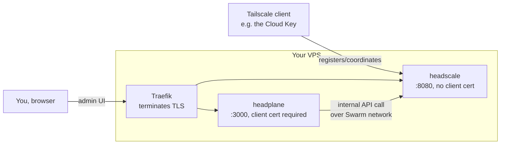

# Self-hosted Headscale + Headplane coordination server

**Scope note:** Parts 1–8 cover the *coordination server* half of
"Tailscale for everyday remote access" — a self-hosted Headscale server
plus a web admin UI, both running behind an existing Traefik + Docker
Swarm reverse proxy on your own VPS. Part 9 covers enrolling a client
(e.g. the Cloud Key) into it. See
[What's not covered yet](#whats-not-covered-yet) at the end for what's
still outside this doc's scope.

Parts 1–8 run on **your own VPS**, not the Cloud Key; Part 9 runs on the
client device being enrolled. Rationale and pitfalls hit while building
this are in [Phase 5 Overview](Phase-5-Overview).

## Why a self-hosted coordination server

Tailscale creates a private virtual network between only the devices you
add to it — each one gets a stable private address, and once two devices
are on the same network they can reach each other directly and securely
regardless of where they physically are or what firewall/NAT sits in
front of them. Under the hood it's built on WireGuard.

Normally, devices coordinate through Tailscale's own hosted servers.
**Headscale** is an independent, open-source program that speaks the
same coordination protocol, so the ordinary Tailscale client software
can't tell the difference — it just gets pointed at your own server
instead of Tailscale's. The upside: you're not depending on a company's
servers staying up for your own network to keep working.

Tailscale (rather than plain WireGuard directly) is the starting choice
specifically because Tailscale's client bundles its own WireGuard
implementation that runs entirely in userspace, with no dependency on
the host kernel's own WireGuard support — useful insurance on hardware
running an old, customized kernel, the exact situation the Cloud Key
itself is in (see [Phase 1](Phase-1-De-Ubiquitizing)).

## Placeholders

| Placeholder | Meaning |
| --- | --- |
| `<vps>` | the VPS this coordination server runs on |
| `<hs-domain>` | the hostname Tailscale clients actually connect to |
| `<admin-domain>` | the hostname for the headplane admin web UI |
| `<hs-domain-base>` | `<hs-domain>` minus its first label (Part 2) |
| `<client-cert-tls-options>` | optional — see note below |

**On `<client-cert-tls-options>`**: an *existing* Traefik `tls.options`
name, only needed if you already protect other admin UIs behind a
client-cert wall and want headplane behind the same one. Omit the line
entirely if you don't have one — headplane's admin UI just won't have a
client-cert gate in front of it.

This doc also assumes your Traefik's external Swarm overlay network is
literally named `traefik`, and that you have an HTTP-01 ACME
certResolver already defined in your static Traefik config named `http`
— adjust every `networks:` and `tls.certresolver` line to match your own
names if they differ.

## Architecture



**The two-hostname split is not a style choice — it's required.** A
browser proves its identity with a client certificate; a Tailscale
client can't (it's a background program speaking the coordination
protocol directly, with no certificate to present). Splitting the
coordination endpoint (`<hs-domain>`, open) from the admin UI
(`<admin-domain>`, client-cert-gated) is the only way to require a
client cert for one and not the other.

> [!NOTE]
> Why not just gate `/admin` on a single shared hostname instead? Traefik
> picks which `tls.options` to enforce per hostname (SNI) at the TLS
> handshake itself — before it's parsed enough of the HTTP request to
> know the path. There's no way to require a client cert for one path
> and not another on the same hostname; the decision can only be made
> per-hostname, which is why this setup needs two.

**headplane is a real backend app, not a browser-side SPA** — the
browser only ever talks to `<admin-domain>`; headplane's own server
process makes the call to `<hs-domain>`'s *internal* service address
itself, over the Swarm network, never through the public internet. This
matters later: no CORS configuration is needed anywhere in this setup,
because there's no cross-origin browser call happening at all.

## Prerequisites

- A VPS with Docker already running in **Swarm mode** (`docker info`
  shows `Swarm: active`), and Traefik already deployed as its own stack
  on an external, attachable overlay network (this doc assumes it's
  named `traefik`).
- An HTTP-01 ACME certResolver already defined in Traefik's static
  config (this doc assumes it's named `http`) — see your own Traefik
  setup for how that's wired; standing up Traefik itself from scratch is
  out of scope here.
- DNS control over the domain `<hs-domain>` / `<admin-domain>` live
  under, so you can point both at the VPS.
- If you want the admin UI behind a client-cert wall: an existing
  `tls.options` block already defined in Traefik's dynamic config
  requiring `RequireAndVerifyClientCert` — this doc doesn't cover
  setting up client-certificate auth itself, only reusing one that
  already exists (`<client-cert-tls-options>`).

## Part 1 — Directory layout

```text
/opt/docker/headscale/
├── headscale.yml         # the Swarm stack file (both services)
├── config.yaml           # headscale server config, mounted read-only
├── acl.hujson            # ACL policy seed - starter allow-all
├── headplane-config.yaml # headplane's own app config
├── Makefile              # deploy/apikey/user/preauthkey/policy helpers
├── data/                 # headscale state: sqlite db + noise key
└── headplane-data/       # headplane state: its own small db/cache
```

```bash
mkdir -p /opt/docker/headscale/{data,headplane-data}
```

## Part 2 — headscale's own config (`config.yaml`)

```yaml
---
server_url: https://<hs-domain>
listen_addr: 0.0.0.0:8080

# Loopback-only inside the container - nothing outside needs to reach
# these directly.
metrics_listen_addr: 127.0.0.1:9090
grpc_listen_addr: 127.0.0.1:50443
grpc_allow_insecure: false

# Traefik is the only thing in front of this container, over an internal
# overlay network - not treating it as a "reverse proxy" for
# header-trust purposes since no ACLs here rely on source IP.
trusted_proxies: []

noise:
  private_key_path: /var/lib/headscale/noise_private.key

prefixes:
  # Example tailnet range. Tailscale's default is 100.64.0.0/10; this
  # guide narrows it to a /16 within that CGNAT space so addresses are
  # easy to eyeball. Pick your own and keep it stable -- changing it only
  # affects newly registered nodes; existing nodes keep their DB-assigned
  # IP until re-registered.
  v4: 100.100.0.0/16
  v6: fd7a:115c:a1e0::/48
  allocation: sequential

# Not self-hosting DERP for a first build - relaying already-encrypted
# WireGuard traffic through Tailscale's public DERP servers doesn't
# touch the coordination/trust this whole setup is actually about
# controlling. Self-hosting DERP later is a clean follow-up, not a
# prerequisite.
derp:
  server:
    enabled: false
  urls:
    - https://controlplane.tailscale.com/derpmap/default
  paths: []
  auto_update_enabled: true
  update_frequency: 24h

disable_check_updates: false

node:
  # No default expiry - nodes stay authenticated until explicitly
  # expired. Tighten this (e.g. 180d, matching Tailscale's own SaaS
  # default) once more devices are enrolled.
  expiry: 0
  ephemeral:
    inactivity_timeout: 30m

database:
  type: sqlite
  debug: false
  gorm:
    prepare_stmt: true
    parameterized_queries: true
    skip_err_record_not_found: true
    slow_threshold: 1000
  sqlite:
    path: /var/lib/headscale/db.sqlite
    write_ahead_log: true
    wal_autocheckpoint: 1000

# TLS is handled by Traefik in front of this container - leave
# headscale's own TLS/ACME settings empty so it just serves plain HTTP
# internally.
acme_url: https://acme-v02.api.letsencrypt.org/directory
acme_email: ""
tls_letsencrypt_hostname: ""
tls_letsencrypt_cache_dir: /var/lib/headscale/cache
tls_letsencrypt_challenge_type: HTTP-01
tls_letsencrypt_listen: ":http"
tls_cert_path: ""
tls_key_path: ""

log:
  level: info
  format: text

# database, not file: headplane's ACL editor calls headscale's own
# SetPolicy API, which headscale refuses outright in file mode ("Read-only
# ACL Policy" in the UI). acl.hujson (Part 3) is a seed file for `headscale
# policy set --file`, not the live source of truth - see Part 3.
policy:
  mode: database

dns:
  magic_dns: true
  # Must differ from the server_url domain. Doesn't need a real DNS
  # entry - MagicDNS names are resolved internally by Tailscale itself.
  base_domain: ts.<hs-domain-base>
  override_local_dns: true
  nameservers:
    global:
      - 1.1.1.1
      - 1.0.0.1
      - 2606:4700:4700::1111
      - 2606:4700:4700::1001
    split: {}
  search_domains: []
  extra_records: []

unix_socket: /var/run/headscale/headscale.sock
unix_socket_permission: "0770"

logtail:
  enabled: false

taildrop:
  enabled: true

auto_update:
  enabled: false
```

`<hs-domain-base>` in `dns.base_domain` is whatever your actual domain
is minus the `hs.` part — e.g. if `<hs-domain>` is `hs.example.com`, use
`ts.example.com` (anything that isn't `<hs-domain>` itself works; it's
never resolved over real DNS).

## Part 3 — ACL policy (`acl.hujson`)

Starter policy: allow all traffic between all of your own devices. Since
`policy.mode` is `database` (Part 2), this file isn't live-enforced by
itself — it's a seed, loaded once via `headscale policy set --file`
(`make policy-set`, Part 6) after the stack is up. Edit through
headplane's ACL editor going forward, or edit this file and re-run
`make policy-set` — either way, `make policy-get` shows what's actually
enforced, since headplane's editor writes straight to the database and
won't touch this file.

```json
{
  "acls": [
    {
      "action": "accept",
      "src": ["*"],
      "dst": ["*:*"],
    },
  ],
}
```

## Part 4 — headplane's own config (`headplane-config.yaml`)

```yaml
server:
  host: "0.0.0.0"
  port: 3000

  # No trailing /admin here - headplane serves its dashboard under
  # /admin itself, on top of whatever base_url is set to.
  base_url: "https://<admin-domain>"

  # Generated once via `make cookie-secret` (Part 6) - never a literal
  # value in this file.
  cookie_secret_path: /run/secrets/headplane-cookie-secret

  cookie_secure: true
  cookie_max_age: 86400
  data_path: /var/lib/headplane

# No oidc: block below, so headplane falls back to its plain "log in
# with a Headscale API key" flow. If you're putting headplane behind a
# client-cert wall (Prerequisites), that's the actual access gate for
# this hostname - the API key is just what tells headplane who's
# asking, generated with `make apikey` (Part 6).

headscale:
  # Internal service-to-service call over the shared `traefik` overlay
  # network - headplane's own backend makes this call server-side, not
  # the browser, so this is never the same as `server_url`/`<hs-domain>`
  # above. "headscale" here is the Swarm service name from
  # headscale.yml (Part 5) - Swarm's internal DNS resolves it directly.
  url: "http://headscale:8080"

  # What the web UI tells users to actually point `tailscale up` at.
  public_url: "https://<hs-domain>"

  # Read-only mount of headscale's own config.yaml (Part 5) - lets
  # headplane display current settings and confirm policy.mode is
  # "database" (required for its ACL editor - see Part 2/3).
  config_path: /etc/headscale/config.yaml

integration:
  agent:
    enabled: false

  docker:
    enabled: true
    container_label: "me.tale.headplane.target=headscale"
    socket: "unix:///var/run/docker.sock"

  # Schema requires these two even when disabled - not actually used
  # since enabled is false, but headplane rejects startup without them.
  kubernetes:
    enabled: false
    validate_manifest: true
    pod_name: "headscale"

  proc:
    enabled: false
```

## Part 5 — the Swarm stack (`headscale.yml`)

```yaml
version: '3.6'

services:
  headscale:
    image: headscale/headscale:v0.29.2
    command: serve
    networks:
      - traefik
    volumes:
      - /etc/localtime:/etc/localtime:ro
      - /opt/docker/headscale/config.yaml:/etc/headscale/config.yaml:ro
      - /opt/docker/headscale/acl.hujson:/etc/headscale/acl.hujson:ro
      - /opt/docker/headscale/data:/var/lib/headscale
    logging:
      driver: syslog
      options:
        tag: docker/headscale/headscale/{{.ID}}
    # Plain container label (not deploy.labels) - headplane's Docker
    # integration talks to the Docker Engine API directly to find this
    # container and signal it after a config.yaml change (e.g. DNS
    # extra_records), rather than going through Traefik's Swarm service
    # labels. ACL edits don't need this - policy.mode is "database"
    # (Part 2), so headscale serves policy changes live from the API,
    # no restart/signal involved.
    labels:
      - "me.tale.headplane.target=headscale"
    deploy:
      replicas: 1
      resources:
        limits:
          cpus: '0.20'
          memory: 128M
      placement:
        constraints:
          - node.role == manager
      restart_policy:
        condition: any
      labels:
        - "traefik.enable=true"

        - "traefik.http.routers.headscale.entrypoints=http"
        - "traefik.http.routers.headscale.rule=Host(`<hs-domain>`)"
        - "traefik.http.routers.headscale.middlewares=https-redirect@file"

        - "traefik.http.routers.headscale-secure.entrypoints=https"
        - "traefik.http.routers.headscale-secure.rule=Host(`<hs-domain>`)"
        - "traefik.http.routers.headscale-secure.tls=true"
        - "traefik.http.routers.headscale-secure.tls.certresolver=http"
        - "traefik.http.routers.headscale-secure.service=headscale"
        - "traefik.http.services.headscale.loadbalancer.server.port=8080"

  headplane:
    # "v0.7.0" is not published as a registry tag as of this writing -
    # headplane's release automation didn't push a versioned tag for
    # every release, only `latest`. Before trusting `latest` long-term,
    # confirm what it actually is: pull it, then check its own
    # org.opencontainers.image.version label and created date against
    # the version you expect (see Phase 5 Overview page for how this was
    # discovered) - pin to that build's digest once confirmed, the way
    # this line does.
    image: ghcr.io/tale/headplane@sha256:7bd6523a14567a43eb4ffa1e95e3d95456b8539c9d081757df3f228b9e836fb5
    networks:
      - traefik
    volumes:
      - /etc/localtime:/etc/localtime:ro
      - /opt/docker/headscale/headplane-config.yaml:/etc/headplane/config.yaml:ro
      - /opt/docker/headscale/config.yaml:/etc/headscale/config.yaml:ro
      - /opt/docker/headscale/headplane-data:/var/lib/headplane
      - /var/run/docker.sock:/var/run/docker.sock:ro
    secrets:
      - headplane-cookie-secret
    logging:
      driver: syslog
      options:
        tag: docker/headscale/headplane/{{.ID}}
    deploy:
      replicas: 1
      resources:
        # 128M is not enough - it wedges the Node process into a
        # near-permanent GC stall (alive, listening, but unresponsive to
        # every request including its own healthcheck) rather than
        # crashing it outright. headplane bundles a full React-Router
        # SSR app plus Docker/Headscale API clients - budget accordingly.
        limits:
          cpus: '0.50'
          memory: 384M
      restart_policy:
        condition: any
      labels:
        - "traefik.enable=true"

        - "traefik.http.routers.headplane.entrypoints=http"
        - "traefik.http.routers.headplane.rule=Host(`<admin-domain>`)"
        - "traefik.http.routers.headplane.middlewares=https-redirect@file"

        - "traefik.http.routers.headplane-secure.entrypoints=https"
        - "traefik.http.routers.headplane-secure.rule=Host(`<admin-domain>`)"
        - "traefik.http.routers.headplane-secure.tls=true"
        - "traefik.http.routers.headplane-secure.tls.certresolver=http"
        # Omit this line entirely if you don't already have a
        # client-cert wall on this Traefik (see Placeholders).
        - "traefik.http.routers.headplane-secure.tls.options=<client-cert-tls-options>@file"
        - "traefik.http.routers.headplane-secure.service=headplane"
        - "traefik.http.services.headplane.loadbalancer.server.port=3000"

networks:
  traefik:
    external: true

secrets:
  headplane-cookie-secret:
    external: true
```

Note the `headscale` service is referred to by its plain name
(`http://headscale:8080`) in `headplane-config.yaml`, not
`<stack>_headscale` — Swarm's embedded DNS resolves the plain service
name across any network both services are attached to, which `traefik`
is here.

## Part 6 — the Makefile

Recipe lines below are real tab-indented Make syntax, not markdown
formatting — copy this verbatim rather than re-typing the indentation.

<!-- markdownlint-disable MD010 -->

```makefile
STACK      := headscale
SERVICE    := $(STACK)_headscale
CONTAINER   = $(shell docker ps -q -f name=$(SERVICE) | head -n1)

USER       ?= <your-username>
USER_ID    ?=
EXPIRATION ?= 366d

.PHONY: deploy update rm ps logs logs-headplane shell cookie-secret \
        apikey apikey-list apikey-expire \
        user-create users \
        preauthkey preauthkey-list \
        policy-get policy-set \
        nodes routes

## --- stack lifecycle ---

deploy:
	docker stack deploy -c $(STACK).yml $(STACK)

update:
	docker stack rm $(STACK) || true
	sleep 10
	docker stack deploy -c $(STACK).yml $(STACK)

rm:
	docker stack rm $(STACK)

ps:
	docker stack ps $(STACK)

logs:
	docker service logs -f $(SERVICE)

logs-headplane:
	docker service logs -f $(STACK)_headplane

shell:
	docker exec -it $(CONTAINER) sh

## --- one-time setup: headplane's session cookie secret ---
## Run once before the first `make deploy`. headplane-config.yaml points
## at this same secret name via cookie_secret_path.

cookie-secret:
	openssl rand -hex 16 | docker secret create headplane-cookie-secret -

## --- API keys (headplane logs in with one instead of OIDC) ---

apikey:
	docker exec $(CONTAINER) headscale apikeys create --expiration $(EXPIRATION)

apikey-list:
	docker exec $(CONTAINER) headscale apikeys list

# make apikey-expire PREFIX=<key-prefix-from-apikey-list>
apikey-expire:
	docker exec $(CONTAINER) headscale apikeys expire --prefix $(PREFIX)

## --- users ---

# make user-create USER=<name>
user-create:
	docker exec $(CONTAINER) headscale users create $(USER)

users:
	docker exec $(CONTAINER) headscale users list

## --- pre-auth keys (for enrolling new nodes without an interactive login) ---
## Unlike USER above, these take the numeric user ID, not the name -
## `headscale preauthkeys create --user` rejects a name outright
## (strconv.ParseUint error). Look it up with `make users` first.

# make preauthkey USER_ID=1 EXPIRATION=1h
preauthkey:
	@if [ -z "$(USER_ID)" ]; then \
		echo "error: USER_ID required (numeric - see 'make users')"; \
		exit 1; \
	fi
	docker exec $(CONTAINER) headscale preauthkeys create \
		--user $(USER_ID) --expiration $(EXPIRATION) --reusable

preauthkey-list:
	@if [ -z "$(USER_ID)" ]; then \
		echo "error: USER_ID required (numeric - see 'make users')"; \
		exit 1; \
	fi
	docker exec $(CONTAINER) headscale preauthkeys list --user $(USER_ID)

## --- ACL policy (database-backed - see acl.hujson's own comment for why) ---

policy-get:
	docker exec $(CONTAINER) headscale policy get

# Re-seed the live (database) policy from acl.hujson, e.g. after hand-
# editing that file. headplane's own ACL editor writes straight to the
# database and doesn't touch this file, so the two can drift - policy-get
# always shows what's actually enforced.
policy-set:
	docker exec $(CONTAINER) headscale policy set --file /etc/headscale/acl.hujson

## --- inspection ---

nodes:
	docker exec $(CONTAINER) headscale nodes list

routes:
	docker exec $(CONTAINER) headscale nodes list-routes
```

**Packaged version**: this whole part is
[`scripts/runbook/phase5-00-headscale-server.sh`](https://github.com/jnovack/cloudkey/blob/main/scripts/runbook/phase5-00-headscale-server.sh),
which writes every file in Parts 1–6 for you from a few environment
variables. Run it **on your VPS**, not the Cloud Key.

## Part 7 — DNS and deploy

> [!WARNING]
> `make deploy` below puts `<hs-domain>` on the open internet — that's
> by design, since Tailscale clients need to reach it from anywhere. But
> `<admin-domain>` (headplane's admin UI) goes public too, and unless
> you set up the optional `<client-cert-tls-options>` line (see
> [Placeholders](#placeholders)), anyone who can resolve that hostname
> can reach its login page. Confirm DNS points where you expect, and
> that you're comfortable with headplane's exposure level, before
> running this.

Point both `<hs-domain>` and `<admin-domain>` at your VPS's public IP,
then:

```bash
cd /opt/docker/headscale
make cookie-secret   # one-time, before the first deploy
make deploy
make policy-set      # seeds the database from acl.hujson - do this
                      # before enrolling any device, not after
```

`make policy-set` matters here specifically because `policy.mode` is
`database` (Part 2/3): skipping it leaves whatever headscale's own
default is in place for however long that gap lasts, rather than the
allow-all policy this doc actually intends from the first device
onward.

## Part 8 — Verify

```bash
curl https://<hs-domain>/health
# expect: {"status":"pass"}

openssl s_client -connect <hs-domain>:443 -servername <hs-domain> \
    </dev/null 2>/dev/null | openssl x509 -noout -subject -checkend 2592000
# subject should read exactly "<hs-domain>" - a real Tailscale client
# validates this strictly and won't enroll against the wrong cert
```

Then check `https://<admin-domain>/admin` in a browser (with your
client cert loaded, if you added the optional `tls.options` line) —
first login prompts for the Headscale server URL and an API key:

```bash
make apikey
```

Paste that key in. From here you can create a user (`make user-create
USER=you`) and find its numeric ID (`make users`).

## Part 9 — Enroll a client device (e.g. the Cloud Key)

This part runs **on the client device itself** (e.g. the Cloud Key from
[Phase 1](Phase-1-De-Ubiquitizing)), not the VPS.

### 1. Install the Tailscale client

```bash
# Cap tailscaled's journal rate before it first starts (why: below).
install -d -m 755 /etc/systemd/system/tailscaled.service.d
cat > /etc/systemd/system/tailscaled.service.d/log-rate-limit.conf <<'EOF'
[Service]
LogRateLimitIntervalSec=5min
LogRateLimitBurst=100
EOF
systemctl daemon-reload

DEBIAN_FRONTEND=noninteractive apt-get install -y ca-certificates curl gnupg
install -m 0755 -d /etc/apt/keyrings
curl -fsSL https://pkgs.tailscale.com/stable/debian/bullseye.noarmor.gpg \
  -o /etc/apt/keyrings/tailscale-archive-keyring.gpg
chmod a+r /etc/apt/keyrings/tailscale-archive-keyring.gpg

repo="deb [signed-by=/etc/apt/keyrings/tailscale-archive-keyring.gpg]"
repo="$repo https://pkgs.tailscale.com/stable/debian bullseye main"
echo "$repo" > /etc/apt/sources.list.d/tailscale.list

apt-get update
DEBIAN_FRONTEND=noninteractive apt-get install -y tailscale
```

Substitute your own distro's codename in both URLs if the client isn't
Debian bullseye. `apt-get install` enables and starts `tailscaled`
automatically — no `tailscale up` yet, that's a separate, explicit step
next.

The rate limit is there because `tailscaled` is the one daemon on this
box that can log itself into a loop: when it can't reach the
coordination server (an expired certificate in front of Headscale is
enough), it logs every retry, at around 150 lines a minute. That fills
Phase 1's journal cap in hours and pushes out the previous boot's logs,
which are exactly the ones you need when the box has died.

`LogRateLimitBurst=100` looks low, but it isn't the real number. journald
multiplies the burst limit based on how much journal space is free:
about ×3 with most of Phase 1's 500M cap free (confirmed on a Cloud Key
with a throwaway unit set to a burst of 5, which kept 16 lines), falling
toward ×1 as the journal fills. So the effective limit is about 300 lines
per 5 minutes, roughly 60 a minute. That's comfortably above a healthy
`tailscaled`, which logs a couple of hundred lines at startup and then a
few a minute, and well below the retry loop. Setting 300 here would
actually allow about 900 per 5 minutes, which wouldn't stop the loop at
all. After the window ends, journald logs a "Suppressed N messages" line
the next time the unit writes, so anything it dropped still leaves a
trace. On a box
where `tailscaled` is already running, the limit only applies once
`tailscaled` restarts. Restarting it drops any SSH session that's
running over the tailnet, so run the restart from another path or
schedule it: `systemd-run --on-active=5s systemctl restart tailscaled`.

**Packaged version**: this step is
[`scripts/runbook/phase5-01-tailscale-client.sh`](https://github.com/jnovack/cloudkey/blob/main/scripts/runbook/phase5-01-tailscale-client.sh).
Run it on the client, not the VPS.

### 2. Generate a pre-auth key (on the VPS)

```bash
cd /opt/docker/headscale
make preauthkey USER_ID=<id> EXPIRATION=1h
```

A short expiration is deliberate here — this key only needs to live long
enough for step 3.

### 3. Join the tailnet (on the client)

```bash
tailscale up --login-server=https://<hs-domain> --authkey=<key-from-step-2>
```

Non-interactive — no browser OAuth step, which matters for a headless,
SSH-only box.

### 4. Verify

On the client:

```bash
tailscale status
# expect: this device listed, "active", with a 100.x.y.z address
```

On the VPS:

```bash
make nodes
# expect: the client listed
```

Then confirm actual reachability over the tailnet address to whatever
this client already serves (e.g. a web UI on some port) from another
device already joined to the same tailnet.

**Confirm persistence with a real reboot**, not assumed — this repo has
precedent for boot-time surprises on specific hardware that no amount of
"should just work" reasoning caught in advance (see the README's
Hardware note). Reboot the client and re-run `tailscale status` — it
should still show the device enrolled.

> [!NOTE]
> A reboot here also surfaced a real boot-time race between `tailscaled`
> and the Phase 4 VPN killswitch's own iptables setup — only relevant if
> you built the optional Phase 4. It's already fixed, folded into
> [Phase 4](Phase-4-WireGuard)/`scripts/runbook/phase4-netns-vpn-up.sh`, so a fresh
> Phase 4 build from that doc won't hit it. Root cause is in
> [Phase 5 Overview](Phase-5-Overview).

## File manifest

### On the VPS

| Path | Purpose |
| --- | --- |
| `/opt/docker/headscale/headscale.yml` | the Swarm stack file |
| `/opt/docker/headscale/config.yaml` | headscale server config |
| `/opt/docker/headscale/acl.hujson` | ACL policy seed (`make policy-set`) |
| `/opt/docker/headscale/headplane-config.yaml` | headplane app config |
| `/opt/docker/headscale/Makefile` | deploy/apikey/user/policy helpers |
| `/opt/docker/headscale/data/` | headscale state: sqlite db + noise key |
| `/opt/docker/headscale/headplane-data/` | headplane state |
| Docker secret `headplane-cookie-secret` | headplane's session cookie key |

### On each enrolled client

| Path | Purpose |
| --- | --- |
| `/etc/apt/keyrings/tailscale-archive-keyring.gpg` | apt signing key |
| `/etc/apt/sources.list.d/tailscale.list` | Tailscale's apt repo |
| `/etc/systemd/system/tailscaled.service.d/log-rate-limit.conf` | caps `tailscaled` at a burst of 100 per 5 minutes (about 300 after journald's free-space scaling) so a retry loop can't push the previous boot out of the journal |
| `/var/lib/tailscale/` | client state (keys, tailnet membership) |

## What's not covered yet

- A hardened ACL policy (starter allow-all in `acl.hujson` to begin
  with).
- OIDC/SSO for headplane (plain API-key login, per Part 4, is enough
  behind a client-cert wall if you have one).
- Self-hosted DERP (Part 2 uses Tailscale's public DERP servers instead
  — see that section's comment for why that's a deliberate choice, not
  a shortcut).
